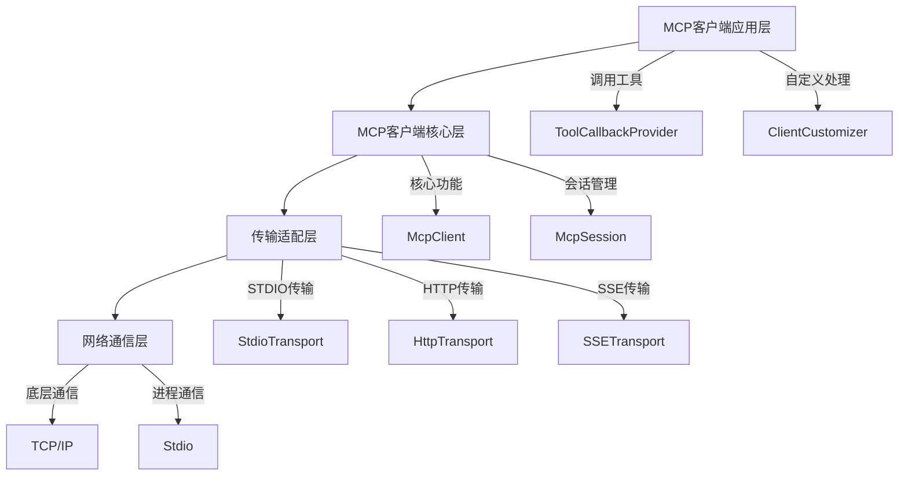

# Spring AI MCP 客户端深度解析与实战指南

## 一、深入理解MCP客户端

### 1.1 MCP客户端核心概念

模型上下文协议（Model Context Protocol，简称MCP）客户端是Spring AI框架中用于与MCP服务器进行交互的核心组件。它允许AI应用程序以标准化的方式访问外部工具、资源和服务，从而扩展AI模型的能力。

MCP客户端的核心价值在于：

1. **标准化交互**：提供统一的接口规范，简化与外部系统的集成
2. **工具发现**：自动发现和注册MCP服务器提供的工具
3. **资源访问**：安全地访问外部资源，如文件系统、数据库等
4. **双向通信**：支持客户端与服务器之间的双向消息传递

### 1.2 客户端架构设计

MCP客户端采用分层架构设计，包含以下几个核心组件：



### 1.3 客户端工作原理

MCP客户端的工作流程如下：

1. **初始化阶段**：
   - 读取配置信息
   - 建立与MCP服务器的连接
   - 进行协议版本协商
   - 获取服务器能力信息

2. **工具注册阶段**：
   - 发现服务器提供的工具
   - 根据过滤规则筛选工具
   - 生成工具名称前缀
   - 注册为Spring AI ToolCallback

3. **运行时阶段**：
   - 接收来自AI模型的工具调用请求
   - 将请求转发给对应的MCP服务器
   - 处理服务器返回的结果
   - 将结果返回给AI模型

## 二、客户端启动器详解

### 2.1 标准MCP客户端启动器

标准MCP客户端启动器（`spring-ai-starter-mcp-client`）是基于Servlet的实现，适用于传统的Spring Boot应用。

#### 2.1.1 依赖配置

```xml
<dependency>
    <groupId>org.springframework.ai</groupId>
    <artifactId>spring-ai-starter-mcp-client</artifactId>
</dependency>
```

#### 2.1.2 支持的传输机制

标准启动器支持以下传输机制：
- **STDIO**：标准输入输出，适用于本地进程通信
- **SSE**：服务器发送事件，基于JDK HttpClient实现
- **Streamable-HTTP**：流式HTTP传输，基于JDK HttpClient实现

### 2.2 WebFlux MCP客户端启动器

WebFlux MCP客户端启动器（`spring-ai-starter-mcp-client-webflux`）是基于响应式编程的实现，适用于响应式Spring Boot应用。

#### 2.2.1 依赖配置

```xml
<dependency>
    <groupId>org.springframework.ai</groupId>
    <artifactId>spring-ai-starter-mcp-client-webflux</artifactId>
</dependency>
```

#### 2.2.2 支持的传输机制

WebFlux启动器支持以下传输机制：
- **SSE**：服务器发送事件，基于WebFlux实现
- **Streamable-HTTP**：流式HTTP传输，基于WebFlux实现
- **Stateless Streamable-HTTP**：无状态流式HTTP传输

## 三、详细配置指南

### 3.1 通用配置属性

MCP客户端的通用配置属性以`spring.ai.mcp.client`为前缀：

| 属性 | 类型 | 默认值 | 描述 |
|------|------|--------|------|
| enabled | boolean | true | 是否启用MCP客户端 |
| name | String | spring-ai-mcp-client | 客户端实例名称 |
| version | String | 1.0.0 | 客户端版本 |
| initialized | boolean | true | 是否在创建时初始化客户端 |
| request-timeout | Duration | 20s | 请求超时时间 |
| type | Enum | SYNC | 客户端类型（SYNC/ASYNC） |
| root-change-notification | boolean | true | 是否启用根变更通知 |
| toolcallback.enabled | boolean | true | 是否启用工具回调集成 |

### 3.2 STDIO传输配置

STDIO传输配置以`spring.ai.mcp.client.stdio`为前缀，用于配置基于标准输入输出的MCP服务器连接。

#### 3.2.1 基本配置示例

```yaml
spring:
  ai:
    mcp:
      client:
        stdio:
          connections:
            filesystem-server:
              command: npx
              args:
                - "-y"
                - "@modelcontextprotocol/server-filesystem"
                - "/path/to/directory"
              env:
                DEBUG: "true"
```

#### 3.2.2 Windows平台特殊配置

在Windows平台上，由于批处理文件执行的特殊性，需要使用cmd.exe包装：

```yaml
spring:
  ai:
    mcp:
      client:
        stdio:
          connections:
            filesystem-server:
              command: cmd.exe
              args:
                - "/c"
                - "npx"
                - "-y"
                - "@modelcontextprotocol/server-filesystem"
                - "C:\\Users\\username\\Documents"
```

#### 3.2.3 外部配置文件

可以使用外部JSON文件配置STDIO连接：

```yaml
spring:
  ai:
    mcp:
      client:
        stdio:
          servers-configuration: classpath:mcp-servers.json
```

对应的JSON配置文件：

```json
{
  "mcpServers": {
    "filesystem": {
      "command": "npx",
      "args": [
        "-y",
        "@modelcontextprotocol/server-filesystem",
        "/Users/username/Desktop",
        "/Users/username/Downloads"
      ]
    }
  }
}
```

### 3.3 SSE传输配置

SSE传输配置以`spring.ai.mcp.client.sse`为前缀，用于配置基于服务器发送事件的MCP服务器连接。

#### 3.3.1 基本配置示例

```yaml
spring:
  ai:
    mcp:
      client:
        sse:
          connections:
            search-server:
              url: http://localhost:8080
            analytics-server:
              url: https://api.example.com
              sse-endpoint: /v1/mcp/events
```

#### 3.3.2 复杂URL配置

对于包含路径和查询参数的复杂URL，需要正确分割：

```yaml
spring:
  ai:
    mcp:
      client:
        sse:
          connections:
            mcp-hub:
              url: http://localhost:3000
              sse-endpoint: /mcp-hub/sse/cf9ec4527e3c4a2cbb149a85ea45ab01
            api-server:
              url: https://api.example.com
              sse-endpoint: /v1/mcp/events?token=abc123&format=json
```

### 3.4 Streamable-HTTP传输配置

Streamable-HTTP传输配置以`spring.ai.mcp.client.streamable-http`为前缀，用于配置基于流式HTTP的MCP服务器连接。

#### 3.4.1 基本配置示例

```yaml
spring:
  ai:
    mcp:
      client:
        streamable-http:
          connections:
            database-server:
              url: http://localhost:8080
            cache-server:
              url: http://cache.internal:8081
              endpoint: /mcp-stream
```

## 四、客户端定制化

### 4.1 客户端定制器

MCP客户端支持通过定制器接口进行深度定制，分为同步和异步两种类型：

#### 4.1.1 同步客户端定制器

```java
@Component
public class CustomMcpSyncClientCustomizer implements McpSyncClientCustomizer {
    @Override
    public void customize(String serverConfigurationName, McpClient.SyncSpec spec) {
        // 设置请求超时
        spec.requestTimeout(Duration.ofSeconds(30));
        
        // 设置采样处理器
        spec.sampling((CreateMessageRequest messageRequest) -> {
            // 处理采样请求
            return createMessageResult;
        });
        
        // 设置征询处理器
        spec.elicitation((ElicitRequest request) -> {
            // 处理征询请求
            return new ElicitResult(ElicitResult.Action.ACCEPT, Map.of());
        });
        
        // 设置进度通知处理器
        spec.progressConsumer((ProgressNotification progress) -> {
            // 处理进度通知
            System.out.println("Progress: " + progress.progress());
        });
        
        // 设置工具变更通知处理器
        spec.toolsChangeConsumer((List<McpSchema.Tool> tools) -> {
            // 处理工具变更
            System.out.println("Tools changed: " + tools.size());
        });
        
        // 设置资源变更通知处理器
        spec.resourcesChangeConsumer((List<McpSchema.Resource> resources) -> {
            // 处理资源变更
            System.out.println("Resources changed: " + resources.size());
        });
        
        // 设置提示变更通知处理器
        spec.promptsChangeConsumer((List<McpSchema.Prompt> prompts) -> {
            // 处理提示变更
            System.out.println("Prompts changed: " + prompts.size());
        });
        
        // 设置日志处理器
        spec.loggingConsumer((McpSchema.LoggingMessageNotification log) -> {
            // 处理日志消息
            System.out.println("Log: " + log.data());
        });
    }
}
```

#### 4.1.2 异步客户端定制器

```java
@Component
public class CustomMcpAsyncClientCustomizer implements McpAsyncClientCustomizer {
    @Override
    public void customize(String serverConfigurationName, McpClient.AsyncSpec spec) {
        // 异步客户端定制逻辑
        spec.requestTimeout(Duration.ofSeconds(30));
        
        // 设置异步采样处理器
        spec.sampling((CreateMessageRequest messageRequest) -> {
            // 异步处理采样请求
            return Mono.just(createMessageResult);
        });
        
        // 其他异步定制逻辑...
    }
}
```

### 4.2 工具过滤器

工具过滤器允许您根据自定义规则筛选MCP服务器提供的工具：

```java
@Component
public class CustomMcpToolFilter implements McpToolFilter {
    @Override
    public boolean test(McpConnectionInfo connectionInfo, McpSchema.Tool tool) {
        // 根据连接信息和工具属性进行过滤
        
        // 排除特定客户端的工具
        if (connectionInfo.clientInfo().name().equals("restricted-client")) {
            return false;
        }
        
        // 只包含特定前缀的工具
        if (tool.name().startsWith("allowed_")) {
            return true;
        }
        
        // 排除实验性工具
        if (tool.description() != null && 
            tool.description().contains("experimental")) {
            return false;
        }
        
        // 默认包含所有其他工具
        return true;
    }
}
```

### 4.3 工具名称前缀生成器

工具名称前缀生成器用于避免多个MCP服务器提供同名工具时的冲突：

```java
@Component
public class CustomToolNamePrefixGenerator implements McpToolNamePrefixGenerator {
    @Override
    public String prefixedToolName(McpConnectionInfo connectionInfo, Tool tool) {
        // 自定义工具名称前缀生成逻辑
        
        // 使用服务器名称和版本作为前缀
        String serverName = connectionInfo.initializeResult().serverInfo().name();
        String serverVersion = connectionInfo.initializeResult().serverInfo().version();
        return serverName + "_v" + serverVersion.replace(".", "_") + "_" + tool.name();
    }
}
```

### 4.4 工具上下文转换器

工具上下文转换器用于将Spring AI的工具上下文转换为MCP元数据：

```java
@Component
public class CustomToolContextToMcpMetaConverter implements ToolContextToMcpMetaConverter {
    @Override
    public Map<String, Object> convert(ToolContext toolContext) {
        if (toolContext == null || toolContext.getContext() == null) {
            return Map.of();
        }
        
        Map<String, Object> metadata = new HashMap<>();
        
        // 为所有键添加自定义前缀
        for (Map.Entry<String, Object> entry : toolContext.getContext().entrySet()) {
            if (entry.getValue() != null) {
                metadata.put("app_" + entry.getKey(), entry.getValue());
            }
        }
        
        // 添加额外的元数据
        metadata.put("timestamp", System.currentTimeMillis());
        metadata.put("source", "spring-ai");
        
        return metadata;
    }
}
```

## 五、MCP客户端注解详解

### 5.1 @McpLogging注解

用于处理来自MCP服务器的日志消息：

```java
@Component
public class McpLoggingHandler {
    @McpLogging(clients = "search-server")
    public void handleServerLogs(LoggingMessageNotification notification) {
        System.out.println("[" + notification.level() + "] " + notification.data());
    }
}
```

### 5.2 @McpSampling注解

用于处理来自MCP服务器的采样请求：

```java
@Component
public class McpSamplingHandler {
    @McpSampling(clients = "llm-server")
    public CreateMessageResult handleSampling(CreateMessageRequest request) {
        // 处理采样请求并生成响应
        return generateResponse(request);
    }
    
    @McpSampling(clients = "llm-server")
    public Mono<CreateMessageResult> handleAsyncSampling(CreateMessageRequest request) {
        // 异步处理采样请求
        return Mono.fromCallable(() -> generateResponse(request))
                   .subscribeOn(Schedulers.boundedElastic());
    }
}
```

### 5.3 @McpElicitation注解

用于处理征询请求，从用户获取额外信息：

```java
@Component
public class McpElicitationHandler {
    @McpElicitation(clients = "interactive-server")
    public ElicitResult handleElicitation(ElicitRequest request) {
        // 处理征询请求
        return new ElicitResult(ElicitResult.Action.ACCEPT, Map.of());
    }
}
```

### 5.4 @McpProgress注解

用于处理进度通知：

```java
@Component
public class McpProgressHandler {
    @McpProgress(clients = "long-running-server")
    public void handleProgress(ProgressNotification notification) {
        int percentage = (int) (notification.progress() * 100);
        System.out.println("Progress: " + percentage + "% - " + notification.message());
    }
}
```

### 5.5 变更通知注解

用于处理各种变更通知：

```java
@Component
public class McpChangeHandlers {
    @McpToolListChanged(clients = "dynamic-server")
    public void handleToolListChanged(List<McpSchema.Tool> tools) {
        System.out.println("Tool list updated: " + tools.size() + " tools");
    }
    
    @McpResourceListChanged(clients = "dynamic-server")
    public void handleResourceListChanged(List<McpSchema.Resource> resources) {
        System.out.println("Resource list updated: " + resources.size() + " resources");
    }
    
    @McpPromptListChanged(clients = "dynamic-server")
    public void handlePromptListChanged(List<McpSchema.Prompt> prompts) {
        System.out.println("Prompt list updated: " + prompts.size() + " prompts");
    }
}
```

## 六、实战应用案例

### 6.1 文件系统访问客户端

创建一个可以访问本地文件系统的MCP客户端：

```java
@Configuration
public class FileSystemMcpClientConfig {
    @Bean
    @ConditionalOnMissingBean
    public McpSyncClient fileSystemMcpClient() {
        ServerParameters params = ServerParameters.builder("npx")
                .args("-y", "@modelcontextprotocol/server-filesystem", "/tmp")
                .build();
        
        return McpClient.sync(new StdioClientTransport(params))
                .name("filesystem-client")
                .requestTimeout(Duration.ofSeconds(30))
                .build()
                .initialize();
    }
}
```

### 6.2 Web搜索客户端

创建一个可以执行Web搜索的MCP客户端：

```java
@Configuration
public class WebSearchMcpClientConfig {
    @Bean
    @ConditionalOnMissingBean
    public McpSyncClient webSearchMcpClient() {
        return McpClient.sync(new SseClientTransport("http://localhost:8080/search"))
                .name("websearch-client")
                .requestTimeout(Duration.ofSeconds(60))
                .build()
                .initialize();
    }
}
```

### 6.3 数据库访问客户端

创建一个可以访问数据库的MCP客户端：

```java
@Configuration
public class DatabaseMcpClientConfig {
    @Bean
    @ConditionalOnMissingBean
    public McpSyncClient databaseMcpClient() {
        return McpClient.sync(new StreamableHttpClientTransport("http://db-service:8080"))
                .name("database-client")
                .requestTimeout(Duration.ofSeconds(45))
                .build()
                .initialize();
    }
}
```

### 6.4 综合配置示例

完整的application.yml配置示例：

```yaml
spring:
  ai:
    mcp:
      client:
        enabled: true
        name: comprehensive-mcp-client
        version: 1.0.0
        request-timeout: 30s
        type: SYNC
        stdio:
          connections:
            filesystem:
              command: npx
              args:
                - "-y"
                - "@modelcontextprotocol/server-filesystem"
                - "/tmp"
                - "/home/user/documents"
        sse:
          connections:
            search:
              url: http://search-service:8080
            analytics:
              url: https://analytics.api.com
              sse-endpoint: /v1/mcp/events?token=secret123
        streamable-http:
          connections:
            database:
              url: http://database-service:8080
              endpoint: /mcp-stream
```

## 七、高级特性与最佳实践

### 7.1 跨平台兼容性处理

为确保MCP客户端在不同操作系统上的兼容性：

```java
@Configuration
public class CrossPlatformMcpConfig {
    @Bean
    @ConditionalOnMissingBean
    public McpSyncClient crossPlatformMcpClient() {
        ServerParameters stdioParams;
        
        if (isWindows()) {
            // Windows平台使用cmd.exe包装
            List<String> args = Arrays.asList("/c", "npx", "-y", 
                "@modelcontextprotocol/server-filesystem", "C:\\temp");
            stdioParams = ServerParameters.builder("cmd.exe").args(args).build();
        } else {
            // Unix-like系统直接执行
            stdioParams = ServerParameters.builder("npx")
                .args("-y", "@modelcontextprotocol/server-filesystem", "/tmp")
                .build();
        }
        
        return McpClient.sync(new StdioClientTransport(stdioParams))
                .requestTimeout(Duration.ofSeconds(30))
                .build()
                .initialize();
    }
    
    private boolean isWindows() {
        return System.getProperty("os.name").toLowerCase().contains("win");
    }
}
```

### 7.2 错误处理与重试机制

实现健壮的错误处理和重试机制：

```java
@Component
public class RobustMcpClientCustomizer implements McpSyncClientCustomizer {
    @Override
    public void customize(String serverConfigurationName, McpClient.SyncSpec spec) {
        // 设置重试策略
        spec.retrySpec(Retry.fixedDelay(3, Duration.ofSeconds(2))
                .filter(throwable -> throwable instanceof McpException)
                .onRetryExhaustedThrow((retryBackoffSpec, retrySignal) -> 
                    new RuntimeException("Max retries exhausted", retrySignal.failure())));
        
        // 设置超时处理
        spec.requestTimeout(Duration.ofSeconds(30));
        
        // 设置异常处理
        spec.errorHandler(throwable -> {
            System.err.println("MCP Error: " + throwable.getMessage());
            // 记录日志、发送告警等
        });
    }
}
```

### 7.3 性能优化策略

优化MCP客户端性能的最佳实践：

1. **连接池管理**：
```java
@Configuration
public class OptimizedMcpConfig {
    @Bean
    public ConnectionPoolSettings connectionPoolSettings() {
        return ConnectionPoolSettings.builder()
                .maxSize(10)
                .maxIdleTime(Duration.ofMinutes(5))
                .build();
    }
}
```

2. **缓存机制**：
```java
@Component
public class CachedMcpToolProvider {
    private final Cache<String, ToolCallback> toolCache = 
        Caffeine.newBuilder()
                .maximumSize(1000)
                .expireAfterWrite(Duration.ofMinutes(10))
                .build();
    
    public ToolCallback getToolCallback(String toolName) {
        return toolCache.get(toolName, this::loadToolCallback);
    }
    
    private ToolCallback loadToolCallback(String toolName) {
        // 加载工具回调逻辑
        return toolCallback;
    }
}
```

3. **批量操作**：
```java
@Component
public class BatchMcpOperations {
    public List<McpResult> batchExecute(List<McpRequest> requests) {
        // 批量执行MCP请求以减少网络开销
        return requests.stream()
                .map(this::executeSingle)
                .collect(Collectors.toList());
    }
}
```

### 7.4 安全性考虑

实现安全的MCP客户端配置：

1. **认证与授权**：
```yaml
spring:
  ai:
    mcp:
      client:
        sse:
          connections:
            secure-server:
              url: https://secure-api.com
              sse-endpoint: /v1/mcp/events?token=${MCP_API_TOKEN}
```

2. **输入验证**：
```java
@Component
public class SecureMcpToolFilter implements McpToolFilter {
    @Override
    public boolean test(McpConnectionInfo connectionInfo, McpSchema.Tool tool) {
        // 验证工具名称
        if (!isValidToolName(tool.name())) {
            return false;
        }
        
        // 验证工具参数
        if (!isValidToolParameters(tool.inputSchema())) {
            return false;
        }
        
        return true;
    }
    
    private boolean isValidToolName(String name) {
        return name != null && name.matches("^[a-zA-Z0-9_-]+$");
    }
    
    private boolean isValidToolParameters(JsonNode inputSchema) {
        // 实现参数验证逻辑
        return true;
    }
}
```

## 八、故障排除与调试

### 8.1 常见问题诊断

1. **连接失败**：
   - 检查服务器地址和端口
   - 验证网络连通性
   - 确认服务器是否正常运行

2. **工具无法发现**：
   - 检查工具过滤器配置
   - 验证服务器是否正确暴露工具
   - 查看日志确认初始化过程

3. **超时问题**：
   - 增加请求超时时间
   - 检查网络延迟
   - 优化服务器性能

### 8.2 调试技巧

1. **启用详细日志**：
```yaml
logging:
  level:
    org.springframework.ai.mcp: DEBUG
    org.springframework.ai.mcp.client: TRACE
```

2. **使用调试工具**：
```java
@Component
public class McpDebugHandlers {
    @McpLogging
    public void debugLogs(LoggingMessageNotification notification) {
        System.out.println("[DEBUG] " + notification.data());
    }
    
    @McpProgress
    public void debugProgress(ProgressNotification notification) {
        System.out.println("[PROGRESS] " + notification.message() + 
                          " (" + (notification.progress() * 100) + "%)");
    }
}
```

3. **监控连接状态**：
```java
@Component
public class McpConnectionMonitor {
    @Autowired
    private List<McpSyncClient> mcpClients;
    
    @Scheduled(fixedRate = 30000) // 每30秒检查一次
    public void monitorConnections() {
        for (McpSyncClient client : mcpClients) {
            try {
                boolean connected = client.ping();
                System.out.println("Client " + client.name() + 
                                 " connection status: " + 
                                 (connected ? "OK" : "FAILED"));
            } catch (Exception e) {
                System.err.println("Failed to check client " + 
                                 client.name() + ": " + e.getMessage());
            }
        }
    }
}
```

## 九、未来发展与扩展

### 9.1 新特性展望

1. **更丰富的传输协议支持**
2. **增强的安全机制**
3. **更好的性能优化**
4. **更完善的监控和管理功能**

### 9.2 自定义扩展点

1. **自定义传输实现**：
```java
public class CustomTransport implements McpTransport {
    // 实现自定义传输逻辑
}
```

2. **自定义序列化器**：
```java
public class CustomJsonMapper implements McpJsonMapper {
    // 实现自定义JSON序列化逻辑
}
```

## 十、总结

Spring AI MCP客户端为AI应用程序提供了强大的外部系统集成能力。通过标准化的协议和丰富的配置选项，开发者可以轻松地将各种工具和服务集成到AI应用中。本文档详细介绍了MCP客户端的各个方面，从基础概念到高级特性，从配置指南到实战案例，希望能帮助开发者更好地理解和使用这一重要功能。

通过合理配置和定制，MCP客户端可以满足各种复杂场景的需求，为构建功能强大的AI应用提供坚实的基础。