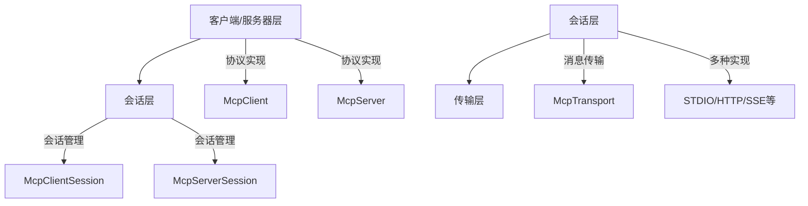

# Spring AI MCP（模型上下文协议）完整使用文档

## 一、核心概念

模型上下文协议（Model Context Protocol，简称MCP）是一种标准化协议，使人工智能模型能够以结构化的方式与外部工具和资源交互。可以把它看作是连接AI模型与现实世界的桥梁——让它们通过一致的界面访问数据库、API、文件系统和其他外部服务。

### 1.1 MCP的核心价值

MCP为AI应用提供了以下核心能力：

1. **标准化接口**：统一的协议规范，使AI模型与外部系统交互变得简单
2. **工具集成**：让AI能够调用各种外部工具和服务
3. **资源访问**：提供对文件、数据库、API等资源的结构化访问
4. **提示管理**：集中管理和分发提示模板
5. **双向通信**：支持模型与外部系统之间的双向交互

### 1.2 MCP的应用场景

MCP适用于多种AI应用场景：

- **企业级AI应用**：连接企业内部系统和数据源
- **工具增强型AI**：为AI模型提供执行具体任务的能力
- **资源访问控制**：安全地管理AI对敏感资源的访问
- **提示工程**：集中管理和优化提示模板

## 二、快速入门

### 2.1 环境准备

在开始使用Spring AI MCP功能之前，需要添加相应的依赖到项目中。

#### 2.1.1 Maven依赖配置

```xml
<!-- MCP客户端依赖 -->
<dependency>
    <groupId>org.springframework.ai</groupId>
    <artifactId>spring-ai-starter-mcp-client</artifactId>
</dependency>

<!-- MCP服务器依赖 -->
<dependency>
    <groupId>org.springframework.ai</groupId>
    <artifactId>spring-ai-starter-mcp-server</artifactId>
</dependency>
```

#### 2.1.2 Gradle依赖配置

```gradle
// MCP客户端依赖
implementation 'org.springframework.ai:spring-ai-starter-mcp-client'

// MCP服务器依赖
implementation 'org.springframework.ai:spring-ai-starter-mcp-server'
```

### 2.2 基本配置

在`application.yml`中配置MCP相关属性：

```yaml
spring:
  ai:
    mcp:
      client:
        enabled: true
        transport: STDIO
      server:
        enabled: true
        protocol: STDIO
```

### 2.3 简单示例

创建一个简单的MCP工具：

```java
import org.springframework.ai.mcp.annotation.McpTool;
import org.springframework.stereotype.Component;

@Component
public class SampleMcpTool {
    
    @McpTool(name = "calculate_sum", description = "计算两个数字的和")
    public int calculateSum(int a, int b) {
        return a + b;
    }
}
```

## 三、MCP Java SDK架构

MCP Java SDK采用三层架构设计，将可维护性和灵活性的考虑区分开来：

### 3.1 架构层次



### 3.2 客户端/服务器层（顶部）

这一层处理主要的应用逻辑和协议操作：

- **McpClient**：管理客户端操作和服务器连接
- **McpServer**：处理服务器端协议操作和客户端请求

### 3.3 会话层（中间层）

中间层管理通信模式并维护连接状态：

- **McpSession**：核心会话管理接口
- **McpClientSession**：客户端特定会话实现
- **McpServerSession**：服务器特定会话实现

### 3.4 传输层（底部）

底层负责实际的消息传输和序列化：

- **McpTransport**：管理JSON-RPC消息序列化和反序列化
- 支持多种传输实现（STDIO、HTTP/SSE、Streamable-HTTP等）
- 为所有高层次通信提供基础

## 四、MCP客户端详解

MCP客户端是模型上下文协议架构中的关键组件，负责建立和管理与MCP服务器的连接。

### 4.1 核心功能

MCP客户端实现协议的客户端端，处理：

1. **协议版本协商**：确保与服务器的兼容性
2. **能力协商**：确定可用功能
3. **消息传输**：通过JSON-RPC进行通信
4. **工具发现与执行**：发现并执行服务器提供的工具
5. **资源获取与管理**：访问和管理服务器资源
6. **提示系统交互**：与提示模板系统交互

### 4.2 可选功能

- **根系管理**：管理工具和资源的层次结构
- **采样支持**：支持模型采样操作
- **同步与异步操作**：支持阻塞和非阻塞操作模式

### 4.3 传输机制

MCP客户端支持多种传输机制：

1. **基于进程通信的Stdio传输**：适用于本地进程间通信
2. **基于Java的HttpClient SSE客户端传输**：适用于HTTP服务器发送事件
3. **WebFlux SSE客户端传输**：用于反应式HTTP流处理

## 五、MCP服务器详解

MCP服务器是模型上下文协议架构中的基础组件，为客户端提供工具、资源和能力。

### 5.1 核心功能

MCP服务器实现协议的服务器端，负责：

1. **服务器端协议操作实现**：处理客户端请求
2. **工具暴露与发现**：向客户端暴露可用工具
3. **基于URI的资源管理**：管理服务器资源
4. **提示模板的提供与处理**：提供提示模板给客户端
5. **与客户的能力谈判**：协商通信能力
6. **结构化日志与通知**：提供结构化日志和通知机制
7. **并发客户端连接管理**：支持多客户端并发连接
8. **同步和异步API支持**：提供同步和异步API

### 5.2 传输实现

MCP服务器支持多种传输实现：

- **Stdio**：标准输入输出传输
- **Streamable-HTTP**：流式HTTP传输
- **Stateless Streamable-HTTP**：无状态流式HTTP传输
- **SSE**：服务器发送事件传输

## 六、Spring AI MCP集成

Spring AI通过专用的启动器和MCP Java注解，全面支持MCP，使构建能够无缝连接外部系统的复杂AI应用变得简单。

### 6.1 Spring Boot启动器

Spring AI提供以下MCP集成启动器：

#### 6.1.1 客户端启动器

1. **spring-ai-starter-mcp-client**
   - 核心启动器，基于Servlet
   - 支持传输机制：STDIO、Streamable-HTTP、Stateless Streamable-HTTP、SSE

2. **spring-ai-starter-mcp-client-webflux**
   - 基于WebFlux的启动器
   - 支持传输机制：Streamable-HTTP、Stateless Streamable-HTTP、SSE

#### 6.1.2 服务器启动器

##### WebMVC服务器启动器

| 服务器类型 | 启动器依赖 | 配置属性 |
|------------|------------|----------|
| SSE WebMVC | spring-ai-starter-mcp-server-webmvc | spring.ai.mcp.server.protocol=SSE 或空 |
| Streamable-HTTP WebMVC | spring-ai-starter-mcp-server-webmvc | spring.ai.mcp.server.protocol=STREAMABLE |
| Stateless Streamable-HTTP WebMVC | spring-ai-starter-mcp-server-webmvc | spring.ai.mcp.server.protocol=STATELESS |

##### WebFlux服务器启动器

| 服务器类型 | 启动器依赖 | 配置属性 |
|------------|------------|----------|
| SSE WebFlux | spring-ai-starter-mcp-server-webflux | spring.ai.mcp.server.protocol=SSE 或空 |
| Streamable-HTTP WebFlux | spring-ai-starter-mcp-server-webflux | spring.ai.mcp.server.protocol=STREAMABLE |
| Stateless Streamable-HTTP WebFlux | spring-ai-starter-mcp-server-webflux | spring.ai.mcp.server.protocol=STATELESS |

### 6.2 配置属性详解

#### 6.2.1 客户端配置

| 属性 | 描述 | 默认值 |
|------|------|--------|
| spring.ai.mcp.client.enabled | 是否启用MCP客户端 | true |
| spring.ai.mcp.client.transport | 传输类型(STDIO, SSE, STREAMABLE, STATELESS) | STDIO |
| spring.ai.mcp.client.server-url | MCP服务器URL(用于HTTP传输) | - |
| spring.ai.mcp.client.connect-timeout | 连接超时时间(毫秒) | 5000 |
| spring.ai.mcp.client.read-timeout | 读取超时时间(毫秒) | 30000 |

#### 6.2.2 服务器配置

| 属性 | 描述 | 默认值 |
|------|------|--------|
| spring.ai.mcp.server.enabled | 是否启用MCP服务器 | true |
| spring.ai.mcp.server.protocol | 服务器协议类型 | STDIO |
| spring.ai.mcp.server.port | 服务器端口 | 8080 |
| spring.ai.mcp.server.path | 服务器路径 | /mcp |

## 七、Spring AI MCP注解

除了程序化的MCP客户端和服务器配置外，Spring AI还通过MCP注解模块为MCP服务器和客户端提供基于注解的方法处理。这种方法简化了MCP操作的创建和注册，采用干净的声明式编程模型，并带有Java注解。

### 7.1 主要注解

#### 7.1.1 服务器注解

1. **@McpTool**：用于定义MCP工具
```java
@McpTool(name = "get_weather", description = "获取指定城市的天气信息")
public String getWeather(String city) {
    return "Sunny in " + city;
}
```

2. **@McpResource**：用于定义MCP资源
```java
@McpResource(uri = "file://config/app.properties", description = "应用配置文件")
public String getAppConfig() {
    return "app.config=value";
}
```

3. **@McpPrompt**：用于定义提示模板
```java
@McpPrompt(name = "code_review", description = "代码审查提示模板")
public String getCodeReviewPrompt() {
    return "Please review the following code: {code}";
}
```

4. **@McpComplete**：用于标记完成处理方法
```java
@McpComplete
public void onComplete(String result) {
    System.out.println("Task completed: " + result);
}
```

#### 7.1.2 客户端注解

1. **@McpLogging**：用于处理日志信息
```java
@McpLogging
public void handleLog(String message) {
    logger.info("MCP Log: " + message);
}
```

2. **@McpSampling**：用于处理采样信息
```java
@McpSampling
public void handleSampling(String sample) {
    System.out.println("Sample: " + sample);
}
```

3. **@McpElicitation**：用于处理引导信息
```java
@McpElicitation
public void handleElicitation(String question) {
    System.out.println("Question: " + question);
}
```

4. **@McpProgress**：用于处理进度信息
```java
@McpProgress
public void handleProgress(int percentage) {
    System.out.println("Progress: " + percentage + "%");
}
```

### 7.2 特殊参数

MCP注解支持以下特殊参数：

1. **McpSyncServerExchange**：同步服务器交换上下文
2. **McpAsyncServerExchange**：异步服务器交换上下文
3. **McpTransportContext**：传输上下文
4. **McpMeta**：元数据信息

### 7.3 自动发现

MCP注解模块支持带可配置包包含/排除功能的注解扫描：

```yaml
spring:
  ai:
    mcp:
      scanning:
        base-packages: 
          - com.example.tools
          - com.example.resources
        exclude-packages:
          - com.example.internal
```

## 八、实战示例

### 8.1 创建MCP服务器

创建一个提供天气查询工具的MCP服务器：

```java
import org.springframework.ai.mcp.annotation.McpTool;
import org.springframework.ai.mcp.annotation.McpResource;
import org.springframework.stereotype.Component;

@Component
public class WeatherService {
    
    @McpTool(name = "get_weather", description = "获取指定城市的天气信息")
    public String getWeather(String city) {
        // 模拟天气查询
        return "当前" + city + "天气晴朗，温度25°C";
    }
    
    @McpResource(uri = "file://weather/cities.txt", description = "支持查询天气的城市列表")
    public String getSupportedCities() {
        return "北京,上海,广州,深圳";
    }
}
```

### 8.2 创建MCP客户端

创建一个使用MCP工具的客户端：

```java
import org.springframework.ai.mcp.client.McpClient;
import org.springframework.beans.factory.annotation.Autowired;
import org.springframework.stereotype.Service;

@Service
public class WeatherClient {
    
    @Autowired
    private McpClient mcpClient;
    
    public String queryWeather(String city) {
        // 调用MCP服务器上的工具
        return mcpClient.callTool("get_weather", city);
    }
}
```

### 8.3 配置MCP服务器

在`application.yml`中配置MCP服务器：

```yaml
spring:
  ai:
    mcp:
      server:
        enabled: true
        protocol: SSE
        port: 8081
        path: /mcp
```

### 8.4 配置MCP客户端

在`application.yml`中配置MCP客户端：

```yaml
spring:
  ai:
    mcp:
      client:
        enabled: true
        transport: SSE
        server-url: http://localhost:8081/mcp
```

## 九、最佳实践

### 9.1 安全性考虑

1. **访问控制**：实施适当的认证和授权机制
2. **输入验证**：对所有输入进行严格验证
3. **资源限制**：限制资源访问和执行时间
4. **日志记录**：记录所有MCP操作以便审计

### 9.2 性能优化

1. **连接池**：使用连接池管理MCP连接
2. **缓存机制**：缓存频繁访问的资源和工具
3. **异步处理**：使用异步操作提高响应速度
4. **批量操作**：尽可能使用批量操作减少网络往返

### 9.3 错误处理

1. **异常捕获**：捕获并处理MCP相关异常
2. **重试机制**：实现适当的重试逻辑
3. **降级策略**：在MCP服务不可用时提供降级方案
4. **监控告警**：监控MCP服务状态并设置告警

## 十、常见问题解答

### Q1：MCP与传统API有什么区别？

MCP提供了更标准化和结构化的交互方式，专门为AI模型与外部系统交互而设计，支持更丰富的语义和能力协商。

### Q2：如何选择合适的传输机制？

- **STDIO**：适用于本地进程间通信
- **SSE**：适用于需要实时推送的场景
- **HTTP流**：适用于Web环境中的流式传输

### Q3：MCP支持哪些编程语言？

MCP协议本身是语言无关的，目前主要的Java实现通过Spring AI提供，其他语言的实现也在开发中。

### Q4：如何调试MCP通信？

可以启用详细的日志记录，查看JSON-RPC消息交换，使用MCP提供的调试工具进行通信跟踪。

## 十一、参考资源

1. [Spring AI官方文档 - MCP集成](https://docs.spring.io/spring-ai/docs/current/reference/html/mcp.html)
2. [MCP GitHub仓库](https://github.com/modelcontextprotocol)
3. [MCP规范文档](https://spec.modelcontextprotocol.io/)
4. [Spring AI示例项目](https://github.com/spring-projects/spring-ai/tree/main/samples/mcp)

通过本文档，您应该能够掌握Spring AI中MCP功能的核心概念和使用方法，并能在实际项目中有效地应用这些技术来构建具备外部系统集成能力的AI应用。