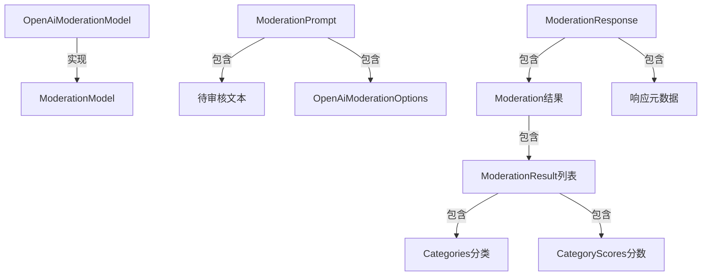

# Spring AI OpenAI 内容审核（Moderation）完整使用文档

## 一、概述

在构建AI应用时，内容安全是一个至关重要的考虑因素。Spring AI集成了OpenAI的内容审核（Moderation）模型，帮助开发者检测文本中的潜在有害或敏感内容，确保应用输出的内容符合安全和合规要求。

内容审核功能可以检测多种类型的内容问题，包括但不限于：
- 暴力内容
- 仇恨言论
- 自残相关内容
- 性相关内容
- 骚扰内容

## 二、先决条件

### OpenAI账户和API密钥

要使用Spring AI的OpenAI内容审核功能，您需要：

1. 访问[OpenAI注册页面](https://platform.openai.com/signup)创建账户
2. 在[API密钥页面](https://platform.openai.com/api-keys)生成API密钥

### 项目依赖配置

Spring AI为OpenAI内容审核模型提供了Spring Boot自动配置。要启用它，请在项目中添加相应依赖。

#### Maven配置

在项目的`pom.xml`文件中添加以下依赖：

```xml
<dependency>
    <groupId>org.springframework.ai</groupId>
    <artifactId>spring-ai-starter-model-openai</artifactId>
</dependency>
```

#### Gradle配置

在Gradle构建文件`build.gradle`中添加以下依赖：

```gradle
dependencies {
    implementation 'org.springframework.ai:spring-ai-starter-model-openai'
}
```

## 三、核心配置详解

### 连接属性配置

使用前缀`spring.ai.openai`配置与OpenAI的连接属性：

| 属性 | 描述 | 默认值 |
|------|------|--------|
| spring.ai.openai.base-url | OpenAI API的基础URL | api.openai.com |
| spring.ai.openai.api-key | API密钥 | - |
| spring.ai.openai.organization-id | 可选的组织ID | - |
| spring.ai.openai.project-id | 可选的项目ID | - |

### 审核模型配置

使用前缀`spring.ai.openai.moderation`配置审核模型属性：

| 属性 | 描述 | 默认值 |
|------|------|--------|
| spring.ai.model.moderation | 启用审核模型 | openai |
| spring.ai.openai.moderation.base-url | 审核API的基础URL | 继承全局配置 |
| spring.ai.openai.moderation.api-key | 审核专用API密钥 | 继承全局配置 |
| spring.ai.openai.moderation.organization-id | 审核请求的组织ID | 继承全局配置 |
| spring.ai.openai.moderation.project-id | 审核请求的项目ID | 继承全局配置 |

### 审核选项配置

使用前缀`spring.ai.openai.moderation.options`配置审核选项：

| 属性 | 描述 | 默认值 |
|------|------|--------|
| spring.ai.openai.moderation.options.model | 用于审核的模型ID | omni-moderation-latest |

## 四、核心API详解

### 主要类关系图



### 核心类说明

#### OpenAiModerationModel（核心客户端）

这是Spring AI封装的OpenAI内容审核客户端，负责检测文本中的潜在有害内容。

```java
@Autowired
private OpenAiModerationModel moderationModel; // 直接注入使用
```

#### ModerationPrompt（请求封装）

封装"待审核文本+审核选项"，作为[moderationModel.call()](file:///E:/java/SpringAi1/src/main/java/org/example/springai1/RAG%E5%92%8CEmbedding/%E8%AF%BB%E5%8F%96%E5%99%A8.java#L25-L25)的入参。

```java
// 基础构造（仅文本内容，使用默认选项）
ModerationPrompt prompt = new ModerationPrompt("待审核的文本内容");

// 完整构造（文本内容+自定义选项）
OpenAiModerationOptions options = OpenAiModerationOptions.builder()
    .model("omni-moderation-latest")
    .build();
ModerationPrompt prompt = new ModerationPrompt("待审核的文本内容", options);
```

#### OpenAiModerationOptions（审核选项）

通过Builder模式配置审核参数：

```java
OpenAiModerationOptions options = OpenAiModerationOptions.builder()
    .model("omni-moderation-latest") // 设置模型
    .build();
```

#### ModerationResponse（响应封装）

存储内容审核结果及元数据：

```java
ModerationResponse response = moderationModel.call(prompt);
Moderation moderation = response.getResult().getOutput(); // 获取审核结果
```

#### Moderation（审核结果）

包含审核的主要信息：

```java
Moderation moderation = response.getResult().getOutput();
String id = moderation.getId(); // 审核ID
String model = moderation.getModel(); // 使用的模型
List<ModerationResult> results = moderation.getResults(); // 审核结果列表
```

#### Categories和CategoryScores（分类和分数）

Categories表示各类敏感内容的布尔值判断，CategoryScores表示各类敏感内容的评分：

```java
for (ModerationResult result : results) {
    boolean isFlagged = result.isFlagged(); // 是否标记为敏感内容
    
    // 获取各类别是否触发
    Categories categories = result.getCategories();
    boolean isSexual = categories.isSexual();
    boolean isHate = categories.isHate();
    boolean isHarassment = categories.isHarassment();
    boolean isSelfHarm = categories.isSelfHarm();
    
    // 获取各类别的评分（0-1之间的数值，越接近1表示越可能属于该类别）
    CategoryScores scores = result.getCategoryScores();
    double sexualScore = scores.getSexual();
    double hateScore = scores.getHate();
    double harassmentScore = scores.getHarassment();
    double selfHarmScore = scores.getSelfHarm();
}
```

## 五、实战示例

### 示例1：基础内容审核

检测文本中是否包含敏感内容：

```java
import org.springframework.ai.moderation.*;
import org.springframework.ai.openai.*;
import org.springframework.beans.factory.annotation.Autowired;
import org.springframework.web.bind.annotation.*;

@RestController
@RequestMapping("/api/moderation")
public class ContentModerationController {
    
    @Autowired
    private OpenAiModerationModel moderationModel;
    
    /**
     * 基础内容审核接口
     * @param text 待审核的文本
     * @return 审核结果
     */
    @PostMapping("/basic")
    public ModerationResult basicModeration(@RequestBody String text) {
        try {
            // 构建请求（使用默认选项）
            ModerationPrompt prompt = new ModerationPrompt(text);
            
            // 调用内容审核模型
            ModerationResponse response = moderationModel.call(prompt);
            
            // 获取审核结果
            Moderation moderation = response.getResult().getOutput();
            
            // 通常只有一个审核结果
            return moderation.getResults().get(0);
        } catch (Exception e) {
            throw new RuntimeException("内容审核失败: " + e.getMessage());
        }
    }
}
```

### 示例2：自定义参数内容审核

使用自定义参数进行内容审核：

```java
import org.springframework.ai.moderation.*;
import org.springframework.ai.openai.*;
import org.springframework.beans.factory.annotation.Autowired;
import org.springframework.web.bind.annotation.*;
import java.util.Map;
import java.util.HashMap;

@RestController
@RequestMapping("/api/moderation")
public class CustomModerationController {
    
    @Autowired
    private OpenAiModerationModel moderationModel;
    
    /**
     * 自定义参数内容审核接口
     * @param text 待审核的文本
     * @return 详细的审核结果
     */
    @PostMapping("/custom")
    public Map<String, Object> customModeration(@RequestBody String text) {
        try {
            // 构建自定义审核选项
            OpenAiModerationOptions options = OpenAiModerationOptions.builder()
                .model("omni-moderation-latest")
                .build();
                
            // 构建请求
            ModerationPrompt prompt = new ModerationPrompt(text, options);
            
            // 调用内容审核模型
            ModerationResponse response = moderationModel.call(prompt);
            
            // 获取审核结果
            Moderation moderation = response.getResult().getOutput();
            ModerationResult result = moderation.getResults().get(0);
            
            // 构建返回结果
            Map<String, Object> resultMap = new HashMap<>();
            resultMap.put("id", moderation.getId());
            resultMap.put("model", moderation.getModel());
            resultMap.put("flagged", result.isFlagged());
            
            // 添加分类结果
            Map<String, Boolean> categoriesMap = new HashMap<>();
            Categories categories = result.getCategories();
            categoriesMap.put("sexual", categories.isSexual());
            categoriesMap.put("hate", categories.isHate());
            categoriesMap.put("harassment", categories.isHarassment());
            categoriesMap.put("self-harm", categories.isSelfHarm());
            categoriesMap.put("sexual/minors", categories.isSexualMinors());
            categoriesMap.put("hate/threatening", categories.isHateThreatening());
            categoriesMap.put("violence/graphic", categories.isViolenceGraphic());
            categoriesMap.put("self-harm/intent", categories.isSelfHarmIntent());
            categoriesMap.put("self-harm/instructions", categories.isSelfHarmInstructions());
            categoriesMap.put("harassment/threatening", categories.isHarassmentThreatening());
            categoriesMap.put("violence", categories.isViolence());
            resultMap.put("categories", categoriesMap);
            
            // 添加分类评分
            Map<String, Double> scoresMap = new HashMap<>();
            CategoryScores scores = result.getCategoryScores();
            scoresMap.put("sexual", scores.getSexual());
            scoresMap.put("hate", scores.getHate());
            scoresMap.put("harassment", scores.getHarassment());
            scoresMap.put("self-harm", scores.getSelfHarm());
            scoresMap.put("sexual/minors", scores.getSexualMinors());
            scoresMap.put("hate/threatening", scores.getHateThreatening());
            scoresMap.put("violence/graphic", scores.getViolenceGraphic());
            scoresMap.put("self-harm/intent", scores.getSelfHarmIntent());
            scoresMap.put("self-harm/instructions", scores.getSelfHarmInstructions());
            scoresMap.put("harassment/threatening", scores.getHarassmentThreatening());
            scoresMap.put("violence", scores.getViolence());
            resultMap.put("category_scores", scoresMap);
            
            return resultMap;
        } catch (Exception e) {
            throw new RuntimeException("内容审核失败: " + e.getMessage());
        }
    }
}
```

### 示例3：批量内容审核服务

为应用提供批量内容审核服务：

```java
import org.springframework.ai.moderation.*;
import org.springframework.ai.openai.*;
import org.springframework.beans.factory.annotation.Autowired;
import org.springframework.stereotype.Service;
import java.util.List;
import java.util.ArrayList;

@Service
public class ContentModerationService {
    
    @Autowired
    private OpenAiModerationModel moderationModel;
    
    /**
     * 批量审核文本内容
     * @param texts 待审核的文本列表
     * @return 审核结果列表
     */
    public List<ModerationResult> moderateTexts(List<String> texts) {
        List<ModerationResult> results = new ArrayList<>();
        
        for (String text : texts) {
            try {
                // 构建请求
                ModerationPrompt prompt = new ModerationPrompt(text);
                
                // 调用内容审核模型
                ModerationResponse response = moderationModel.call(prompt);
                
                // 获取审核结果
                Moderation moderation = response.getResult().getOutput();
                ModerationResult result = moderation.getResults().get(0);
                
                results.add(result);
            } catch (Exception e) {
                // 处理单个文本审核失败的情况
                throw new RuntimeException("审核文本失败: " + text + ", 错误: " + e.getMessage());
            }
        }
        
        return results;
    }
    
    /**
     * 检查文本是否包含敏感内容
     * @param text 待检查的文本
     * @return 是否包含敏感内容
     */
    public boolean isContentFlagged(String text) {
        try {
            // 构建请求
            ModerationPrompt prompt = new ModerationPrompt(text);
            
            // 调用内容审核模型
            ModerationResponse response = moderationModel.call(prompt);
            
            // 获取审核结果
            Moderation moderation = response.getResult().getOutput();
            ModerationResult result = moderation.getResults().get(0);
            
            return result.isFlagged();
        } catch (Exception e) {
            throw new RuntimeException("内容检查失败: " + e.getMessage());
        }
    }
}
```

### 示例4：内容审核拦截器

创建一个内容审核拦截器，自动拦截包含敏感内容的请求：

```java
import org.springframework.ai.moderation.*;
import org.springframework.ai.openai.*;
import org.springframework.beans.factory.annotation.Autowired;
import org.springframework.stereotype.Component;
import org.springframework.web.servlet.HandlerInterceptor;
import javax.servlet.http.HttpServletRequest;
import javax.servlet.http.HttpServletResponse;
import java.util.stream.Collectors;
import java.io.BufferedReader;
import java.io.IOException;

@Component
public class ContentModerationInterceptor implements HandlerInterceptor {
    
    @Autowired
    private OpenAiModerationModel moderationModel;
    
    @Override
    public boolean preHandle(HttpServletRequest request, HttpServletResponse response, Object handler) throws Exception {
        // 只拦截POST请求
        if (!"POST".equals(request.getMethod())) {
            return true;
        }
        
        // 读取请求体内容
        String requestBody = getRequestBody(request);
        
        // 如果请求体为空，放行
        if (requestBody == null || requestBody.trim().isEmpty()) {
            return true;
        }
        
        // 审核内容
        if (isContentFlagged(requestBody)) {
            // 如果内容被标记为敏感，拒绝请求
            response.setStatus(HttpServletResponse.SC_FORBIDDEN);
            response.getWriter().write("{\"error\": \"内容包含敏感信息，请求被拒绝\"}");
            return false;
        }
        
        return true;
    }
    
    /**
     * 读取请求体内容
     */
    private String getRequestBody(HttpServletRequest request) throws IOException {
        StringBuilder stringBuilder = new StringBuilder();
        BufferedReader bufferedReader = request.getReader();
        String line;
        while ((line = bufferedReader.readLine()) != null) {
            stringBuilder.append(line);
        }
        return stringBuilder.toString();
    }
    
    /**
     * 检查内容是否被标记为敏感
     */
    private boolean isContentFlagged(String content) {
        try {
            // 构建请求
            ModerationPrompt prompt = new ModerationPrompt(content);
            
            // 调用内容审核模型
            ModerationResponse response = moderationModel.call(prompt);
            
            // 获取审核结果
            Moderation moderation = response.getResult().getOutput();
            ModerationResult result = moderation.getResults().get(0);
            
            return result.isFlagged();
        } catch (Exception e) {
            // 如果审核失败，默认放行
            return false;
        }
    }
}
```

## 六、审核类别详解

OpenAI的内容审核模型可以检测以下类别的内容：

### 主要类别

1. **sexual（性相关内容）**：
   - 检测包含性内容的文本
   
2. **hate（仇恨言论）**：
   - 检测基于种族、宗教、性别等的仇恨言论
   
3. **harassment（骚扰内容）**：
   - 检测针对个人或群体的骚扰内容
   
4. **self-harm（自残相关内容）**：
   - 检测涉及自残或自杀的内容

### 细分类别

1. **sexual/minors（未成年人性相关内容）**：
   - 检测涉及未成年人的性相关内容
   
2. **hate/threatening（威胁性仇恨言论）**：
   - 检测包含暴力威胁的仇恨言论
   
3. **violence/graphic（暴力/血腥内容）**：
   - 检测暴力或血腥描述
   
4. **self-harm/intent（自残意图）**：
   - 检测表达自残意图的内容
   
5. **self-harm/instructions（自残指导）**：
   - 检测提供自残方法指导的内容
   
6. **harassment/threatening（威胁性骚扰）**：
   - 检测包含威胁的骚扰内容
   
7. **violence（暴力内容）**：
   - 检测一般性暴力内容

## 七、最佳实践建议

### 1. 模型选择

当前默认使用`omni-moderation-latest`模型，这是OpenAI最新的内容审核模型，具有最佳的检测能力。

### 2. 审核策略

建议根据应用场景制定不同的审核策略：

```java
public class ModerationPolicy {
    
    // 宽松策略：仅在高置信度时标记
    public boolean isFlaggedLoose(ModerationResult result) {
        CategoryScores scores = result.getCategoryScores();
        return scores.getSexual() > 0.9 || 
               scores.getHate() > 0.9 || 
               scores.getHarassment() > 0.9 || 
               scores.getSelfHarm() > 0.9;
    }
    
    // 严格策略：在中等置信度时标记
    public boolean isFlaggedStrict(ModerationResult result) {
        CategoryScores scores = result.getCategoryScores();
        return scores.getSexual() > 0.7 || 
               scores.getHate() > 0.7 || 
               scores.getHarassment() > 0.7 || 
               scores.getSelfHarm() > 0.7;
    }
}
```

### 3. 性能优化

1. **批量处理**：对于大量文本审核需求，考虑批量处理以提高效率
2. **缓存机制**：对已审核的内容可以建立缓存，避免重复审核
3. **异步处理**：对于非实时要求的审核场景，可以使用异步处理

### 4. 错误处理

```java
public class ModerationErrorHandler {
    
    public void handleModerationError(Exception e) {
        if (e instanceof RuntimeException) {
            // 记录错误日志
            System.err.println("内容审核错误: " + e.getMessage());
            // 根据业务需求决定是否放行内容
            // 建议在审核服务不可用时，默认放行内容以保证服务可用性
        }
    }
}
```

## 八、常见问题解答

### Q1：如何处理API密钥安全问题？

建议不要在代码中硬编码API密钥，而应该通过环境变量或配置文件注入：

```yaml
spring:
  ai:
    openai:
      api-key: ${OPENAI_API_KEY}
```

### Q2：审核结果的准确性如何？

OpenAI的内容审核模型具有很高的准确性，但没有任何系统是100%准确的。建议：
1. 结合人工审核处理边界情况
2. 根据应用场景调整敏感度阈值
3. 定期评估审核结果并优化策略

### Q3：如何处理审核API的速率限制？

OpenAI对API调用有速率限制，建议：
1. 实现重试机制
2. 使用缓存避免重复审核
3. 在高并发场景下使用队列机制

### Q4：支持哪些语言的内容审核？

OpenAI的内容审核模型支持多种语言，包括但不限于：
- 中文
- 英语
- 日语
- 韩语
- 法语
- 德语
- 西班牙语

## 九、参考资源

1. [Spring AI官方文档 - OpenAI审核功能](https://docs.spring.io/spring-ai/docs/1.1.0/reference/html/openai.html)
2. [OpenAI官方文档 - 审核API](https://platform.openai.com/docs/guides/moderation)
3. [Spring AI示例仓库](https://github.com/spring-projects/spring-ai/tree/main/samples/openai-moderation)

通过本文档，您应该能够掌握Spring AI中OpenAI内容审核功能的基本使用方法，并能在实际项目中应用这些技术来确保内容安全。