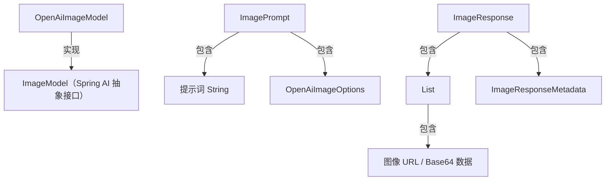

# Spring AI OpenAI 图像生成模型（DALL-E）完整使用文档

## 一、核心定位与基础概念

### 1. 模块定位

Spring AI `spring-ai-starter-model-openai` 模块是 **OpenAI 图像生成 API（DALL-E 模型）的 Spring 生态封装**，核心价值在于：


* 提供统一 Spring 风格接口，屏蔽 OpenAI 底层 HTTP 调用、签名验证等复杂度

* 支持 DALL-E 2/3 模型快速切换，业务代码无需修改

* 内置重试、配置管理等企业级特性，降低生产环境集成成本

* 支持文本提示词（Prompt）生成图像，自定义尺寸、质量、风格等参数

### 2. 关键术语定义


| 术语            | 说明                                                      |
| ------------- | ------------------------------------------------------- |
| DALL-E 模型     | OpenAI 文本到图像生成模型，分为 DALL-E 2（性价比优先）和 DALL-E 3（质量优先）     |
| 提示词（Prompt）   | 描述图像内容的文本指令（如 “浅奶油色迷你金毛犬，阳光草地背景”），是生成核心输入               |
| 图像选项（Options） | 控制生成效果的参数（尺寸、质量、生成数量等），模型不同支持选项有差异                      |
| 响应格式          | 图像返回方式：`url`（临时链接，有效期 1 小时）/ `b64_json`（Base64 编码，可持久化） |
| 重试机制          | 针对网络波动、服务限流等场景的自动重试策略，可通过配置调整                           |

### 3. DALL-E 2 vs DALL-E 3 核心差异


| 特性      | DALL-E 2                  | DALL-E 3                              |
| ------- | ------------------------- | ------------------------------------- |
| 图像质量    | 良好，适合普通场景                 | 支持 HD 高清模式，细节更细腻、色彩更一致                |
| 尺寸支持    | 256x256、512x512、1024x1024 | 1024x1024、1792x1024（宽屏）、1024x1792（竖屏） |
| 生成数量（n） | 1-10 张（批量生成）              | 仅支持 n=1（OpenAI 官方限制）                  |
| 风格选项    | 无                         | 支持 `vivid`（生动夸张）/ `natural`（自然写实）     |
| 质量参数    | 无                         | 支持 `standard`（默认）/ `hd`（高清）           |
| 提示词理解能力 | 需精细化描述复杂场景                | 支持长提示词（≤4000 字符），复杂指令理解更精准            |
| 响应速度    | 较快（1-3 秒）                 | 较慢（3-5 秒，高清模式更久）                      |

## 二、环境准备

### 1. 先决条件


* **OpenAI 账户**：注册地址 [htt](https://platform.openai.com/signup)[ps://](https://platform.openai.com/signup)[platf](https://platform.openai.com/signup)[orm.o](https://platform.openai.com/signup)[penai](https://platform.openai.com/signup)[.com/](https://platform.openai.com/signup)[signu](https://platform.openai.com/signup)[p](https://platform.openai.com/signup)

* **API 密钥**：生成地址 [ht](https://platform.openai.com/api-keys)[tps:/](https://platform.openai.com/api-keys)[/plat](https://platform.openai.com/api-keys)[form.](https://platform.openai.com/api-keys)[opena](https://platform.openai.com/api-keys)[i.com](https://platform.openai.com/api-keys)[/api-](https://platform.openai.com/api-keys)[keys](https://platform.openai.com/api-keys)（推荐创建 “图像生成专用密钥”）

* **可选信息**：若账户属于多组织 / 多项目，需记录 `Organization ID` 和 `Project ID`（OpenAI 控制台 > 个人中心获取）

### 2. 依赖配置

#### 2.1 Maven 配置（pom.xml）


```
\<!-- 1. 引入 Spring AI BOM（统一版本管理） -->

\<dependencyManagement>

&#x20;   \<dependencies>

&#x20;       \<dependency>

&#x20;           \<groupId>org.springframework.ai\</groupId>

&#x20;           \<artifactId>spring-ai-bom\</artifactId>

&#x20;           \<version>1.1.0\</version> \<!-- 与 Spring AI 版本保持一致 -->

&#x20;           \<type>pom\</type>

&#x20;           \<scope>import\</scope>

&#x20;       \</dependency>

&#x20;   \</dependencies>

\</dependencyManagement>

\<!-- 2. 引入 OpenAI 图像生成依赖 -->

\<dependencies>

&#x20;   \<dependency>

&#x20;       \<groupId>org.springframework.ai\</groupId>

&#x20;       \<artifactId>spring-ai-starter-model-openai\</artifactId>

&#x20;   \</dependency>

&#x20;   \<!-- 可选：Spring Boot Web 依赖（用于接口暴露） -->

&#x20;   \<dependency>

&#x20;       \<groupId>org.springframework.boot\</groupId>

&#x20;       \<artifactId>spring-boot-starter-web\</artifactId>

&#x20;   \</dependency>

\</dependencies>
```

#### 2.2 Gradle 配置（build.gradle）


```
// 1. 引入 Spring AI BOM

dependencyManagement {

&#x20;   imports {

&#x20;       mavenBom 'org.springframework.ai:spring-ai-bom:1.1.0'

&#x20;   }

}

// 2. 引入依赖

dependencies {

&#x20;   implementation 'org.springframework.ai:spring-ai-starter-model-openai'

&#x20;   // 可选：Spring Boot Web 依赖

&#x20;   implementation 'org.springframework.boot:spring-boot-starter-web'

}
```

### 3. API 密钥安全配置

**严禁硬编码密钥**，推荐以下两种配置方式（优先级：环境变量 > 配置文件）：

#### 3.1 环境变量配置（推荐）


* **Windows（CMD 终端）**：


```
set OPENAI\_API\_KEY=sk-你的API密钥（如 sk-xxxxxxxxxxxxxxxxxxxxxxxxxx）
```


* **Linux/Mac（终端）**：


```
export OPENAI\_API\_KEY=sk-你的API密钥
```


* **生产环境**：在服务器 / 容器（Docker/K8s）的环境变量中配置

#### 3.2 配置文件配置（application.yml）


```
spring:

&#x20; ai:

&#x20;   # 1. OpenAI 全局配置

&#x20;   openai:

&#x20;     api-key: \${OPENAI\_API\_KEY} # 引用环境变量，避免硬编码

&#x20;     organization-id: \${OPENAI\_ORG\_ID:} # 可选，多组织用户配置

&#x20;     project-id: \${OPENAI\_PROJECT\_ID:} # 可选，多项目用户配置

&#x20;    &#x20;

&#x20;   # 2. 重试机制配置（默认值可直接使用，按需调整）

&#x20;   retry:

&#x20;     max-attempts: 10 # 最大重试次数

&#x20;     backoff:

&#x20;       initial-interval: 2000ms # 初始退避时间（2秒）

&#x20;       multiplier: 5 # 退避倍数（每次重试间隔 ×5）

&#x20;       max-interval: 180000ms # 最大退避时间（3分钟）

&#x20;     on-client-errors: false # 4xx 客户端错误是否重试（默认不重试）

&#x20;     exclude-on-http-codes: \[] # 不重试的 HTTP 状态码

&#x20;     on-http-codes: \[] # 强制重试的 HTTP 状态码

&#x20;    &#x20;

&#x20;   # 3. 图像生成启用配置（默认启用 OpenAI 图像模型）

&#x20;   model:

&#x20;     image: openai # 禁用时设为 none

&#x20;    &#x20;

&#x20;   # 4. 图像生成专属配置（覆盖全局配置）

&#x20;   openai:

&#x20;     image:

&#x20;       base-url: \${OPENAI\_IMAGE\_BASE\_URL:} # 可选，图像生成专属代理地址

&#x20;       api-key: \${OPENAI\_IMAGE\_API\_KEY:} # 可选，图像生成专属密钥

&#x20;       options:

&#x20;         # 图像生成默认参数（启动时配置，可被运行时覆盖）

&#x20;         model: dall-e-2 # 默认模型

&#x20;         n: 1 # 默认生成数量

&#x20;         size: 1024x1024 # 默认尺寸

&#x20;         response-format: url # 默认响应格式
```

## 三、核心配置详解

### 1. 三级配置优先级

Spring AI 图像生成支持三级配置，优先级从高到低为：

`运行时参数（ImagePrompt 中的 Options）` > `图像专属配置（``spring.ai``.openai.image.*）` > `全局配置（``spring.ai``.openai.*）`

### 2. 关键配置项说明

#### 2.1 全局连接配置（spring.ai.openai.\*）


| 配置项                              | 描述              | 默认值                                      | 说明                                          |
| -------------------------------- | --------------- | ---------------------------------------- | ------------------------------------------- |
| spring.ai.openai.base-url        | OpenAI API 基础地址 | [api.openai.com](https://api.openai.com) | 代理场景可配置为自定义地址（如 `https://openai-proxy.com`） |
| spring.ai.openai.api-key         | 全局 API 密钥       | -                                        | 必须配置，通过环境变量或配置文件注入                          |
| spring.ai.openai.organization-id | 组织 ID           | -                                        | 多组织用户配置，关联账单                                |
| spring.ai.openai.project-id      | 项目 ID           | -                                        | 多项目用户配置，关联项目使用量                             |

#### 2.2 图像专属配置（spring.ai.openai.image.\*）


| 配置项                                    | 描述            | 默认值           | 说明             |
| -------------------------------------- | ------------- | ------------- | -------------- |
| spring.ai.openai.image.base-url        | 图像生成专属基础地址    | 继承全局 base-url | 单独配置图像生成的代理地址  |
| spring.ai.openai.image.api-key         | 图像生成专属 API 密钥 | 继承全局 api-key  | 单独使用一个密钥用于图像生成 |
| spring.ai.openai.image.organization-id | 图像生成专属组织 ID   | 继承全局配置        | 单独关联图像生成的账单    |
| spring.ai.openai.image.project-id      | 图像生成专属项目 ID   | 继承全局配置        | 单独关联图像生成的项目    |

#### 2.3 图像生成默认参数（spring.ai.openai.image.options.\*）


| 配置项                                             | 描述       | 默认值       | 取值范围 / 适用模型                                                               |
| ----------------------------------------------- | -------- | --------- | ------------------------------------------------------------------------- |
| spring.ai.openai.image.options.model            | 默认使用的模型  | dall-e-2  | dall-e-2 / dall-e-3                                                       |
| spring.ai.openai.image.options.n                | 生成图像数量   | 1         | 1-10（dall-e-2）；仅 1（dall-e-3）                                              |
| spring.ai.openai.image.options.quality          | 图像质量     | standard  | standard/hd（仅 dall-e-3）                                                   |
| spring.ai.openai.image.options.response\_format | 响应格式     | url       | url / b64\_json                                                           |
| spring.ai.openai.image.options.size             | 图像尺寸     | 1024x1024 | dall-e-2：256x256/512x512/1024x1024；dall-e-3：1024x1024/1792x1024/1024x1792 |
| spring.ai.openai.image.options.style            | 图像风格     | -         | vivid/natural（仅 dall-e-3）                                                 |
| spring.ai.openai.image.options.user             | 终端用户唯一标识 | -         | 用于 OpenAI 监控滥用行为（如用户 ID）                                                  |

## 四、核心 API 详解

### 1. 核心类关系




### 2. 核心类说明

#### 2.1 OpenAiImageModel（核心客户端）


* **作用**：Spring AI 封装的 OpenAI 图像生成客户端，负责发送请求并接收响应

* **创建方式**：Spring Boot 自动注入（无需手动创建）


```
@Autowired

private OpenAiImageModel openAiImageModel; // 直接注入使用
```

#### 2.2 ImagePrompt（请求封装）


* **作用**：封装 “提示词 + 运行时参数”，作为 `OpenAiImageModel.call()` 的入参

* **构造方法**：


```
// 1. 仅传入提示词（使用默认配置）

ImagePrompt prompt = new ImagePrompt("浅奶油色迷你金毛犬");

// 2. 传入提示词 + 自定义参数（运行时覆盖默认配置）

ImagePrompt prompt = new ImagePrompt(

&#x20;   "浅奶油色迷你金毛犬，阳光草地背景",

&#x20;   OpenAiImageOptions.builder()

&#x20;       .model("dall-e-3")

&#x20;       .quality("hd")

&#x20;       .size("1792x1024")

&#x20;       .build()

);
```

#### 2.3 OpenAiImageOptions（参数配置）


* **作用**：通过 Builder 模式配置图像生成参数，支持链式调用

* **常用方法**：


```
OpenAiImageOptions options = OpenAiImageOptions.builder()

&#x20;   .model("dall-e-3") // 设置模型

&#x20;   .n(1) // 设置生成数量

&#x20;   .quality("hd") // 设置质量（仅 dall-e-3）

&#x20;   .responseFormat("b64\_json") // 设置响应格式

&#x20;   .size("1024x1792") // 设置尺寸

&#x20;   .style("natural") // 设置风格（仅 dall-e-3）

&#x20;   .user("user-123") // 设置用户标识

&#x20;   .build();
```

#### 2.4 ImageResponse（响应封装）


* **作用**：图像生成的返回结果，包含所有生成的图像信息

* **核心方法**：


| 方法            | 描述         | 返回值类型                 |
| ------------- | ---------- | --------------------- |
| getResults()  | 获取所有图像生成结果 | List                  |
| getMetadata() | 获取响应元数据    | ImageResponseMetadata |

#### 2.5 ImageGeneration（单张图像结果）


* **作用**：存储单张图像的详细信息

* **核心方法**：


| 方法                 | 描述             | 返回值类型                   | 适用场景                       |
| ------------------ | -------------- | ----------------------- | -------------------------- |
| getUrl()           | 获取图像临时 URL     | String                  | responseFormat = url       |
| getB64Json()       | 获取图像 Base64 编码 | String                  | responseFormat = b64\_json |
| getRevisedPrompt() | 获取优化后的提示词      | String                  | 仅 dall-e-3（模型自动优化提示词）      |
| getMetadata()      | 获取单张图像元数据      | ImageGenerationMetadata | -                          |

### 3. 核心方法：call ()


* **作用**：同步调用 OpenAI 图像生成 API，返回 `ImageResponse`

* **方法签名**：


```
ImageResponse call(ImagePrompt prompt);
```


* **说明**：当前不支持流式生成，调用为阻塞式（需注意超时配置）

## 五、实战示例（可直接复制使用）

### 示例 1：基础图像生成（默认配置）

**场景**：使用默认参数生成单张图像，返回临时 URL


```
import org.springframework.ai.openai.image.ImagePrompt;

import org.springframework.ai.openai.image.ImageResponse;

import org.springframework.ai.openai.image.OpenAiImageModel;

import org.springframework.beans.factory.annotation.Autowired;

import org.springframework.web.bind.annotation.GetMapping;

import org.springframework.web.bind.annotation.RequestParam;

import org.springframework.web.bind.annotation.RestController;

@RestController

public class BasicImageController {

&#x20;   @Autowired

&#x20;   private OpenAiImageModel openAiImageModel;

&#x20;   /\*\*

&#x20;    \* 基础图像生成接口

&#x20;    \* @param prompt 图像提示词

&#x20;    \* @return 图像临时 URL

&#x20;    \*/

&#x20;   @GetMapping("/api/image/basic")

&#x20;   public String generateBasicImage(@RequestParam String prompt) {

&#x20;       // 1. 构建请求（使用默认配置）

&#x20;       ImagePrompt imagePrompt = new ImagePrompt(prompt);

&#x20;      &#x20;

&#x20;       // 2. 调用模型生成图像

&#x20;       ImageResponse response = openAiImageModel.call(imagePrompt);

&#x20;      &#x20;

&#x20;       // 3. 提取第一张图像的 URL（默认生成 1 张）

&#x20;       return response.getResults().get(0).getUrl();

&#x20;   }

}
```

**调用示例**（浏览器 / Postman）：


```
http://localhost:8080/api/image/basic?prompt=A light cream colored mini golden doodle on a sunny grassland
```

**返回结果**：


```
https://oaidalleapiprodscus.blob.core.windows.net/private/...（有效期 1 小时）
```

### 示例 2：DALL-E 3 高清图像生成（自定义参数）

**场景**：生成 DALL-E 3 高清、自然风格的竖屏图像，返回 Base64 编码


```
import org.springframework.ai.openai.image.ImagePrompt;

import org.springframework.ai.openai.image.ImageResponse;

import org.springframework.ai.openai.image.OpenAiImageModel;

import org.springframework.ai.openai.image.OpenAiImageOptions;

import org.springframework.beans.factory.annotation.Autowired;

import org.springframework.web.bind.annotation.GetMapping;

import org.springframework.web.bind.annotation.RequestParam;

import org.springframework.web.bind.annotation.RestController;

@RestController

public class HdImageController {

&#x20;   @Autowired

&#x20;   private OpenAiImageModel openAiImageModel;

&#x20;   /\*\*

&#x20;    \* DALL-E 3 高清图像生成接口

&#x20;    \* @param prompt 图像提示词

&#x20;    \* @return Base64 编码的图像（可直接在前端渲染）

&#x20;    \*/

&#x20;   @GetMapping("/api/image/hd")

&#x20;   public String generateHdImage(@RequestParam String prompt) {

&#x20;       // 1. 构建 DALL-E 3 专属参数

&#x20;       OpenAiImageOptions options = OpenAiImageOptions.builder()

&#x20;           .model("dall-e-3")

&#x20;           .quality("hd") // 高清质量

&#x20;           .style("natural") // 自然风格

&#x20;           .size("1024x1792") // 竖屏尺寸

&#x20;           .responseFormat("b64\_json") // 返回 Base64 编码

&#x20;           .user("user-123") // 用户标识（用于监控）

&#x20;           .build();

&#x20;       // 2. 构建请求

&#x20;       ImagePrompt imagePrompt = new ImagePrompt(prompt, options);

&#x20;       // 3. 调用模型

&#x20;       ImageResponse response = openAiImageModel.call(imagePrompt);

&#x20;       // 4. 构建 Base64 图像格式（前端可直接渲染）

&#x20;       String base64Data = response.getResults().get(0).getB64Json();

&#x20;       return "data:image/png;base64," + base64Data;

&#x20;   }

}
```

**调用示例**：


```
http://localhost:8080/api/image/hd?prompt=A cute cat wearing a hat, sitting by a window, rainy day outside, realistic style
```

### 示例 3：DALL-E 2 批量图像生成

**场景**：使用 DALL-E 2 生成 3 张批量图像，返回 URL 列表


```
import org.springframework.ai.openai.image.ImagePrompt;

import org.springframework.ai.openai.image.ImageResponse;

import org.springframework.ai.openai.image.OpenAiImageModel;

import org.springframework.ai.openai.image.OpenAiImageOptions;

import org.springframework.beans.factory.annotation.Autowired;

import org.springframework.web.bind.annotation.GetMapping;

import org.springframework.web.bind.annotation.RequestParam;

import org.springframework.web.bind.annotation.RestController;

import java.util.List;

import java.util.stream.Collectors;

@RestController

public class BatchImageController {

&#x20;   @Autowired

&#x20;   private OpenAiImageModel openAiImageModel;

&#x20;   /\*\*

&#x20;    \* DALL-E 2 批量图像生成接口

&#x20;    \* @param prompt 图像提示词

&#x20;    \* @return 图像 URL 列表

&#x20;    \*/

&#x20;   @GetMapping("/api/image/batch")

&#x20;   public List\<String> generateBatchImages(@RequestParam String prompt) {

&#x20;       // 1. 构建 DALL-E 2 批量参数

&#x20;       OpenAiImageOptions options = OpenAiImageOptions.builder()

&#x20;           .model("dall-e-2")

&#x20;           .n(3) // 生成 3 张图像

&#x20;           .size("512x512") // 中等尺寸（平衡速度和质量）

&#x20;           .responseFormat("url")

&#x20;           .build();

&#x20;       // 2. 构建请求

&#x20;       ImagePrompt imagePrompt = new ImagePrompt(prompt, options);

&#x20;       // 3. 调用模型

&#x20;       ImageResponse response = openAiImageModel.call(imagePrompt);

&#x20;       // 4. 提取所有图像 URL

&#x20;       return response.getResults().stream()

&#x20;           .map(imageGeneration -> imageGeneration.getUrl())

&#x20;           .collect(Collectors.toList());

&#x20;   }

}
```

**调用示例**：


```
http://localhost:8080/api/image/batch?prompt=Sci-fi style space station, neon lights, outer space background
```

**返回结果**：


```
\[

&#x20; "https://oaidalleapiprodscus.blob.core.windows.net/private/...",

&#x20; "https://oaidalleapiprodscus.blob.core.windows.net/private/...",

&#x20; "https://oaidalleapiprodscus.blob.core.windows.net/private/..."

]
```

### 示例 4：异常处理（全局异常拦截）


```
import org.springframework.ai.openai.OpenAiApiException;

import org.springframework.ai.retry.TransientAiException;

import org.springframework.http.HttpStatus;

import org.springframework.web.bind.annotation.ExceptionHandler;

import org.springframework.web.bind.annotation.ResponseStatus;

import org.springframework.web.bind.annotation.RestControllerAdvice;

import java.util.HashMap;

import java.util.Map;

@RestControllerAdvice

public class ImageExceptionHandler {

&#x20;   /\*\*

&#x20;    \* 处理 OpenAI API 直接错误（如密钥无效、提示词违规）

&#x20;    \*/

&#x20;   @ExceptionHandler(OpenAiApiException.class)

&#x20;   @ResponseStatus(HttpStatus.BAD\_REQUEST)

&#x20;   public Map\<String, String> handleOpenAiApiException(OpenAiApiException e) {

&#x20;       Map\<String, String> result = new HashMap<>();

&#x20;       result.put("code", "400");

&#x20;       result.put("message", "API 调用失败：" + e.getMessage());

&#x20;       return result;

&#x20;   }

&#x20;   /\*\*

&#x20;    \* 处理 transient 错误（网络波动、限流，已重试但失败）

&#x20;    \*/

&#x20;   @ExceptionHandler(TransientAiException.class)

&#x20;   @ResponseStatus(HttpStatus.SERVICE\_UNAVAILABLE)

&#x20;   public Map\<String, String> handleTransientException(TransientAiException e) {

&#x20;       Map\<String, String> result = new HashMap<>();

&#x20;       result.put("code", "503");

&#x20;       result.put("message", "服务暂时不可用，请稍后重试：" + e.getMessage());

&#x20;       return result;

&#x20;   }

&#x20;   /\*\*

&#x20;    \* 处理其他未知错误

&#x20;    \*/

&#x20;   @ExceptionHandler(Exception.class)

&#x20;   @ResponseStatus(HttpStatus.INTERNAL\_SERVER\_ERROR)

&#x20;   public Map\<String, String> handleException(Exception e) {

&#x20;       Map\<String, String> result = new HashMap<>();

&#x20;       result.put("code", "500");

&#x20;       result.put("message", "图像生成失败：" + e.getMessage());

&#x20;       return result;

&#x20;   }

}
```

## 六、进阶技巧与注意事项

### 1. 重试机制优化

针对高频调用场景，建议调整重试配置以平衡效率和成功率：


```
spring:

&#x20; ai:

&#x20;   retry:

&#x20;     max-attempts: 5 # 减少重试次数（避免长时间等待）

&#x20;     backoff:

&#x20;       initial-interval: 1000ms # 缩短初始退避时间

&#x20;       multiplier: 2 # 降低退避倍数（每次间隔 ×2）

&#x20;     on-http-codes: \[500, 503, 504] # 仅对服务端错误重试
```

### 2. 提示词优化技巧（提升生成质量）

#### 2.1 明确三要素：主体 + 风格 + 场景


```
\# 差示例：模糊描述

"A cat"

\# 好示例：明确主体、风格、场景

"A black cat with green eyes, sitting on a wooden table, watercolor painting style, soft natural light"
```

#### 2.2 DALL-E 3 长提示词技巧

利用 DALL-E 3 长提示词支持（≤4000 字符），补充细节：


```
"A cozy coffee shop in Tokyo at night, neon signs outside the window, rain falling, a barista wearing a blue apron making latte art, customers reading books, warm lighting, photorealistic style, 8K resolution"
```

### 3. 常见问题（FAQ）

#### Q1：API 密钥无效或无权限？


* 检查密钥是否正确（避免空格、换行）；

* 检查密钥是否有图像生成权限（OpenAI 密钥默认支持所有 API）；

* 检查账户是否有余额（免费额度过期后需充值）。

#### Q2：生成图像时提示 “n must be 1 for dall-e-3”？


* DALL-E 3 不支持多图生成，需将 `n` 参数设为 1。

#### Q3：返回的 URL 无法访问？


* URL 有效期为 1 小时，过期后需重新生成；

* 检查网络是否能访问 OpenAI 的 blob 存储（部分地区需配置代理）；

* 改用 `b64_json` 格式，避免依赖外部链接。

#### Q4：生成速度慢？


* 降低图像尺寸（如 512x512 比 1024x1024 快）；

* 切换到 DALL-E 2（比 DALL-E 3 快 2-3 倍）；

* 减少 `n` 参数（生成数量越少越快）。

## 七、参考资源


1. **Spring AI 官方文档**：[OpenAI 图像生成](https://docs.spring.io/spring-ai/docs/1.1.0/reference/html/openai.html#openai-image)

2. **OpenAI 官方文档**：[DALL-E API](https://platform.openai.com/docs/guides/images)

3. **Spring AI 示例仓库**：[OpenAI 图像生成示例](https://github.com/spring-projects/spring-ai/tree/main/samples/openai-image)

4. **OpenAI API 密钥管理**：[https://platform.openai.com/api-keys](https://platform.openai.com/api-keys)

5. **DALL-E 3 风格指南**：[OpenAI DALL-E 3 Style Guide](https://platform.openai.com/docs/guides/images/dall-e-3-style-guide)

> （注：文档部分内容可能由 AI 生成）