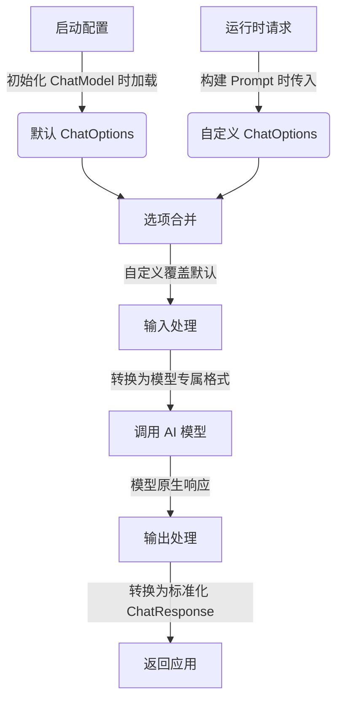

# Spring AI 聊天模型 API 核心文档

## 一、API 核心定位

Spring AI 聊天模型 API 是一套**统一、可移植的 AI 聊天交互接口**，旨在解决不同 AI 模型集成的碎片化问题，核心价值体现在：


1. **模型无关性**：屏蔽 OpenAI、Ollama、Google Gemini 等模型的底层差异，切换模型时代码变更最小

2. **Spring 生态契合**：遵循 Spring 模块化、可扩展理念，支持依赖注入、配置外部化等特性

3. **复杂度封装**：自动处理请求格式化、响应解析、多模态适配等细节，降低 AI 集成门槛

4. **场景全覆盖**：支持同步聊天、流式响应、工具调用、多轮对话等主流 AI 交互场景

## 二、核心接口体系

### 2.1 基础聊天接口：`ChatModel`

定义同步聊天交互的标准契约，支持完整的请求配置与结构化响应。


```
public interface ChatModel extends Model\<Prompt, ChatResponse>, StreamingChatModel {

&#x20;   /\*\*

&#x20;    \* 简化调用：直接传入字符串消息，返回字符串响应

&#x20;    \* 适用场景：快速原型开发、简单对话需求

&#x20;    \*/

&#x20;   default String call(String message) {...}

&#x20;   /\*\*

&#x20;    \* 标准调用：传入 Prompt 对象（含对话上下文+模型参数），返回结构化 ChatResponse

&#x20;    \* 适用场景：生产环境、复杂对话（多轮/工具调用）

&#x20;    \*/

&#x20;   @Override

&#x20;   ChatResponse call(Prompt prompt);

}
```

### 2.2 流式聊天接口：`StreamingChatModel`

支持实时流式响应（如逐字输出、长文本生成），基于 Spring 反应式编程 `Flux` 实现。


```
public interface StreamingChatModel extends StreamingModel\<Prompt, ChatResponse> {

&#x20;   /\*\*

&#x20;    \* 简化流式调用：返回字符串流

&#x20;    \*/

&#x20;   default Flux\<String> stream(String message) {...}

&#x20;   /\*\*

&#x20;    \* 标准流式调用：返回 ChatResponse 流（含元数据）

&#x20;    \*/

&#x20;   @Override

&#x20;   Flux\<ChatResponse> stream(Prompt prompt);

}
```

**关键特性**：


* 支持断点续传（部分模型）

* 低延迟：无需等待完整响应生成

* 适配 WebFlux 异步架构

## 三、关键数据结构

### 3.1 提示词封装：`Prompt`

统一 API 输入格式，封装「对话上下文 + 模型运行时参数」。


```
public class Prompt implements ModelRequest\<List\<Message>> {

&#x20;   // 多轮对话的消息列表（系统/用户/助手消息等）

&#x20;   private final List\<Message> messages;

&#x20;   // 模型运行时配置（可覆盖启动默认值）

&#x20;   private ChatOptions modelOptions;

&#x20;   // 获取模型配置

&#x20;   @Override

&#x20;   public ChatOptions getOptions() {...}

&#x20;   // 获取对话指令（消息列表）

&#x20;   @Override

&#x20;   public List\<Message> getInstructions() {...}

}
```

**使用示例**：


```
// 构建多轮对话 Prompt

List\<Message> messages = Arrays.asList(

&#x20;   new SystemMessage("你是专业的电影推荐助手"),

&#x20;   new UserMessage("推荐3部科幻电影")

);

ChatOptions options = OpenAiChatOptions.builder()

&#x20;   .temperature(0.7f)

&#x20;   .maxTokens(500)

&#x20;   .build();

Prompt prompt = new Prompt(messages, options);
```

### 3.2 消息体系：`Message`

定义对话中不同角色的消息规范，支持文本与多模态内容。

#### 3.2.1 核心接口


```
// 基础内容接口（文本+元数据）

public interface Content {

&#x20;   // 消息文本内容

&#x20;   String getText();

&#x20;   // 元数据（如消息ID、时间戳、来源）

&#x20;   Map\<String, Object> getMetadata();

}

// 消息主接口（含类型标识）

public interface Message extends Content {

&#x20;   // 消息类型（区分角色/用途）

&#x20;   MessageType getMessageType();

}

// 多模态扩展接口（支持图片、音频等）

public interface MediaContent extends Content {

&#x20;   // 多模态资源集合（如图片URL、音频流）

&#x20;   Collection\<Media> getMedia();

}
```

#### 3.2.2 常用消息类型


| 实现类                | 消息类型（`MessageType`） | 作用场景              | 对应模型角色示例           |
| ------------------ | ------------------- | ----------------- | ------------------ |
| `SystemMessage`    | `SYSTEM`            | 全局指令（设定 AI 人设、规则） | OpenAI `system`    |
| `UserMessage`      | `USER`              | 用户输入 / 查询 / 需求    | OpenAI `user`      |
| `AssistantMessage` | `ASSISTANT`         | AI 生成的响应内容        | OpenAI `assistant` |
| `FunctionMessage`  | `FUNCTION`          | 工具调用结果返回          | OpenAI `function`  |
| `ImageMessage`     | `MEDIA`             | 图片输入（多模态）         | GPT-4V、Gemini Pro  |

**多模态消息示例**：


```
// 构建含图片的用户消息

Media image = new UrlMedia("https://example.com/photo.jpg", MediaType.IMAGE\_JPEG);

Message imageMessage = new ImageMessage(Arrays.asList(image), "分析这张图片的内容");
```

### 3.3 模型配置选项：`ChatOptions`

定义模型调用参数，支持通用参数与模型专属扩展。


```
public interface ChatOptions extends ModelOptions {

&#x20;   // 模型名称（如 gpt-5-mini、gemini-pro、llama3:8b）

&#x20;   String getModel();

&#x20;   // 随机性控制（0-1，值越低输出越确定）

&#x20;   Float getTemperature();

&#x20;   // 最大生成令牌数（控制响应长度）

&#x20;   Integer getMaxTokens();

&#x20;   // 核采样（0-1，控制输出多样性，与 temperature 二选一）

&#x20;   Float getTopP();

&#x20;   // 停止序列（遇到指定字符串时终止生成）

&#x20;   List\<String> getStopSequences();

&#x20;   // 频率惩罚（减少重复内容，-2.0 \~ 2.0）

&#x20;   Float getFrequencyPenalty();

&#x20;   // 存在惩罚（增加新内容概率，-2.0 \~ 2.0）

&#x20;   Float getPresencePenalty();

&#x20;   // 复制配置（用于参数修改）

&#x20;   ChatOptions copy();

}
```

**模型专属扩展**：


* OpenAI：`logitBias`（token 权重调整）、`seed`（随机种子）

* Anthropic：`topK`（采样候选集大小）、`systemPrompt`（独立系统提示）

* Google Gemini：`safetySettings`（安全策略）、`generationConfig`（生成配置）

### 3.4 响应封装：`ChatResponse` 与 `Generation`

标准化模型输出格式，统一「内容 + 元数据」获取方式。

#### 3.4.1 顶层响应：`ChatResponse`


```
public class ChatResponse implements ModelResponse\<Generation> {

&#x20;   // 响应元数据（耗时、令牌使用量、模型版本等）

&#x20;   private final ChatResponseMetadata chatResponseMetadata;

&#x20;   // 生成结果列表（支持多候选输出，如 n=3 生成3个响应）

&#x20;   private final List\<Generation> generations;

&#x20;   // 获取元数据

&#x20;   @Override

&#x20;   public ChatResponseMetadata getMetadata() {...}

&#x20;   // 获取生成结果

&#x20;   @Override

&#x20;   public List\<Generation> getResults() {...}

}
```

#### 3.4.2 生成结果：`Generation`


```
public class Generation implements ModelResult\<AssistantMessage> {

&#x20;   // AI 生成的助手消息（核心内容）

&#x20;   private final AssistantMessage assistantMessage;

&#x20;   // 生成元数据（完成原因、令牌统计、置信度等）

&#x20;   private ChatGenerationMetadata chatGenerationMetadata;

&#x20;   // 获取 AI 生成内容

&#x20;   @Override

&#x20;   public AssistantMessage getOutput() {...}

&#x20;   // 获取生成元数据

&#x20;   @Override

&#x20;   public ChatGenerationMetadata getMetadata() {...}

}
```

**响应解析示例**：


```
ChatResponse response = chatModel.call(prompt);

// 获取第一个生成结果

Generation generation = response.getResults().get(0);

// 获取 AI 回复文本

String aiReply = generation.getOutput().getText();

// 获取令牌使用量

ChatResponseMetadata metadata = response.getMetadata();

int totalTokens = metadata.getTotalTokens();
```

## 四、核心工作流程（配置与执行）

Spring AI 采用「启动默认配置 + 运行时覆盖」的双层配置机制，流程如下：




**配置优先级**：

`Prompt 中的自定义 ChatOptions` > `启动时默认 ChatOptions` > `模型默认参数`

## 五、可用模型实现

Spring AI 已集成 10+ 主流 AI 模型，支持差异化特性：


| 模型供应商                   | 核心支持特性                     | 不支持特性    |
| ----------------------- | -------------------------- | -------- |
| OpenAI                  | 流式响应、多模态、工具调用、Prompt 缓存    | -        |
| Microsoft Azure OpenAI  | 流式响应、工具调用、企业级权限控制          | 部分多模态模型  |
| Ollama（本地部署）            | 流式响应、多模态、工具调用              | 部分高级模型参数 |
| Google Vertex AI Gemini | 流式响应、多模态（文本 / 图片 / 音频）     | 部分工具调用功能 |
| Amazon Bedrock          | 多模型集成（Claude、Titan、Llama3） | 部分模型无流式  |
| Mistral AI              | 流式响应、工具调用、代码生成优化           | 多模态支持有限  |
| Anthropic（Claude）       | 长上下文（100k+ tokens）、流式响应    | 多模态支持有限  |
| Hugging Face            | 开源模型本地部署                   | 无流式响应    |

## 六、核心优势总结


1. **开发效率高**：无需重复编写各模型的 SDK 调用代码，一套 API 走到底

2. **灵活性强**：支持同步 / 流式、单模态 / 多模态、默认 / 自定义参数等场景

3. **企业级特性**：集成 Spring 生态的可观测性（Micrometer）、安全（OAuth2）、配置管理

4. **可扩展性好**：支持自定义 `Message` 类型、`ChatOptions` 参数、响应转换器

5. **学习成本低**：遵循 Spring 开发者熟悉的编程范式（如 Builder 模式、接口抽象）

## 七、典型使用场景


| 场景     | 技术选型                          | 优势体现                 |
| ------ | ----------------------------- | -------------------- |
| 智能客服   | `ChatModel` + 多轮 `Message`    | 上下文管理清晰，切换模型无需改代码    |
| 实时文章生成 | `StreamingChatModel` + `Flux` | 低延迟，用户体验好            |
| 图片内容分析 | `ImageMessage` + Gemini Pro   | 多模态支持开箱即用            |
| 动态参数调整 | 不同 `ChatOptions` 配置           | 同一模型可适配不同场景（问答 / 创作） |
| 本地化部署  | Ollama + `ChatModel`          | 无需联网，数据隐私可控          |

> （注：文档部分内容可能由 AI 生成）