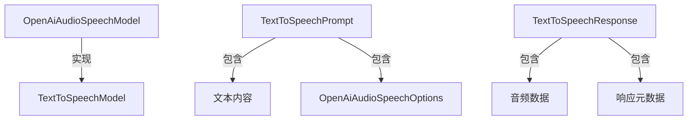

# Spring AI OpenAI 文本转语音（TTS）完整使用文档

在现代人工智能应用中，文本转语音（Text-to-Speech，TTS）技术已经成为不可或缺的一部分。Spring AI框架集成了OpenAI的TTS模型，使得开发者可以轻松地将文本转换为自然流畅的语音输出。本文将详细介绍如何在Spring AI中使用OpenAI的文本转语音功能。

## 核心功能

Spring AI的OpenAI TTS功能支持以下核心能力：

1. **文字转语音叙述**：将任何文本内容转换为自然语音，适用于有声读物、播客等应用场景
2. **多语言语音生成**：支持多种语言的语音合成，满足国际化需求
3. **实时音频流媒体**：通过流式传输实现边生成边播放的实时音频体验

## 环境准备

### 先决条件

在开始使用Spring AI的TTS功能之前，需要完成以下准备工作：

1. **OpenAI账户和API密钥**：
   - 访问[OpenAI注册页面](https://platform.openai.com/signup)创建账户
   - 在[API密钥页面](https://platform.openai.com/api-keys)生成API密钥

2. **项目依赖配置**：
   Spring AI为OpenAI文本转语音客户端提供了Spring Boot自动配置。要启用它，请在项目中添加相应依赖。

### Maven依赖配置

在项目的`pom.xml`文件中添加以下依赖：

```xml
<dependency>
    <groupId>org.springframework.ai</groupId>
    <artifactId>spring-ai-starter-model-openai</artifactId>
</dependency>
```

### Gradle依赖配置

在Gradle构建文件`build.gradle`中添加以下依赖：

```gradle
dependencies {
    implementation 'org.springframework.ai:spring-ai-starter-model-openai'
}
```

## 核心配置详解

### 连接属性配置

使用前缀`spring.ai.openai`配置与OpenAI的连接属性：

| 属性 | 描述 | 默认值 |
|------|------|--------|
| spring.ai.openai.base-url | OpenAI API的基础URL | api.openai.com |
| spring.ai.openai.api-key | API密钥 | - |
| spring.ai.openai.organization-id | 可选的组织ID | - |
| spring.ai.openai.project-id | 可选的项目ID | - |

### TTS模型配置

使用前缀`spring.ai.openai.audio.speech`配置TTS模型属性：

| 属性 | 描述 | 默认值 |
|------|------|--------|
| spring.ai.model.audio.speech | 启用音频语音模型 | openai |
| spring.ai.openai.audio.speech.base-url | TTS API的基础URL | 继承全局配置 |
| spring.ai.openai.audio.speech.api-key | TTS专用API密钥 | 继承全局配置 |
| spring.ai.openai.audio.speech.organization-id | TTS请求的组织ID | 继承全局配置 |
| spring.ai.openai.audio.speech.project-id | TTS请求的项目ID | 继承全局配置 |

### 语音选项配置

使用前缀`spring.ai.openai.audio.speech.options`配置语音合成选项：

| 属性 | 描述 | 默认值 | 可选值 |
|------|------|--------|--------|
| spring.ai.openai.audio.speech.options.model | 语音合成模型 | gpt-4o-mini-tts | gpt-4o-mini-tts, gpt-4o-tts, tts-1, tts-1-hd |
| spring.ai.openai.audio.speech.options.voice | 合成语音的声音 | alloy | alloy, echo, fable, onyx, nova, shimmer |
| spring.ai.openai.audio.speech.options.response-format | 音频输出格式 | mp3 | mp3, opus, aac, flac, wav, pcm |
| spring.ai.openai.audio.speech.options.speed | 语音合成速度 | 1.0 | 0.25-4.0 |

## 核心API详解

### 主要类关系图



### 核心类说明

#### OpenAiAudioSpeechModel（核心客户端）

这是Spring AI封装的OpenAI文本转语音客户端，负责将文本转换为语音数据。

```java
@Autowired
private OpenAiAudioSpeechModel speechModel; // 直接注入使用
```

#### TextToSpeechPrompt（请求封装）

封装"文本内容+语音选项"，作为[speechModel.call()](file:///E:/java/SpringAi1/src/main/java/org/example/springai1/RAG%E5%92%8CEmbedding/%E8%AF%BB%E5%8F%96%E5%99%A8.java#L25-L25)的入参。

```java
// 基础构造（仅文本内容，使用默认选项）
TextToSpeechPrompt prompt = new TextToSpeechPrompt("你好，世界！");

// 完整构造（文本内容+自定义选项）
OpenAiAudioSpeechOptions options = OpenAiAudioSpeechOptions.builder()
    .model("gpt-4o-tts")
    .voice(OpenAiAudioApi.SpeechRequest.Voice.NOVA)
    .responseFormat(OpenAiAudioApi.SpeechRequest.AudioResponseFormat.MP3)
    .speed(1.2)
    .build();
TextToSpeechPrompt prompt = new TextToSpeechPrompt("你好，世界！", options);
```

#### OpenAiAudioSpeechOptions（语音选项）

通过Builder模式配置语音合成参数：

```java
OpenAiAudioSpeechOptions options = OpenAiAudioSpeechOptions.builder()
    .model("tts-1") // 设置模型
    .voice(OpenAiAudioApi.SpeechRequest.Voice.ALLOY) // 设置声音
    .responseFormat(OpenAiAudioApi.SpeechRequest.AudioResponseFormat.WAV) // 设置输出格式
    .speed(0.8) // 设置语速（较慢）
    .build();
```

#### TextToSpeechResponse（响应封装）

存储语音合成结果及元数据：

```java
TextToSpeechResponse response = speechModel.call(prompt);
byte[] audioData = response.getResult().getOutput(); // 获取音频数据
```

## 实战示例

### 示例1：基础文本转语音

将文本转换为MP3格式的音频：

```java
import org.springframework.ai.audio.tts.*;
import org.springframework.beans.factory.annotation.Autowired;
import org.springframework.web.bind.annotation.*;

@RestController
@RequestMapping("/api/tts")
public class TextToSpeechController {
    
    @Autowired
    private OpenAiAudioSpeechModel speechModel;
    
    /**
     * 基础文本转语音接口
     * @param text 待转换的文本
     * @return 音频数据
     */
    @PostMapping("/basic")
    public ResponseEntity<byte[]> basicTts(@RequestBody String text) {
        try {
            // 构建请求（使用默认选项）
            TextToSpeechPrompt prompt = new TextToSpeechPrompt(text);
            
            // 调用语音合成模型
            TextToSpeechResponse response = speechModel.call(prompt);
            
            // 返回音频数据
            return ResponseEntity.ok()
                .contentType(MediaType.parseMediaType("audio/mpeg"))
                .body(response.getResult().getOutput());
        } catch (Exception e) {
            return ResponseEntity.internalServerError().build();
        }
    }
}
```

### 示例2：自定义参数语音合成

使用自定义参数生成特定声音和格式的音频：

```java
import org.springframework.ai.audio.tts.*;
import org.springframework.ai.openai.api.OpenAiAudioApi;
import org.springframework.beans.factory.annotation.Autowired;
import org.springframework.http.MediaType;
import org.springframework.web.bind.annotation.*;

@RestController
@RequestMapping("/api/tts")
public class CustomTtsController {
    
    @Autowired
    private OpenAiAudioSpeechModel speechModel;
    
    /**
     * 自定义参数语音合成接口
     * @param text 待转换的文本
     * @return WAV格式音频数据
     */
    @PostMapping(value = "/custom", produces = MediaType.APPLICATION_OCTET_STREAM_VALUE)
    public ResponseEntity<byte[]> customTts(@RequestBody String text) {
        try {
            // 构建自定义语音选项
            OpenAiAudioSpeechOptions options = OpenAiAudioSpeechOptions.builder()
                .model("gpt-4o-tts")
                .voice(OpenAiAudioApi.SpeechRequest.Voice.FABLE)
                .responseFormat(OpenAiAudioApi.SpeechRequest.AudioResponseFormat.WAV)
                .speed(1.0)
                .build();
                
            // 构建请求
            TextToSpeechPrompt prompt = new TextToSpeechPrompt(text, options);
            
            // 调用语音合成模型
            TextToSpeechResponse response = speechModel.call(prompt);
            
            // 返回WAV格式音频数据
            return ResponseEntity.ok()
                .contentType(MediaType.parseMediaType("audio/wav"))
                .body(response.getResult().getOutput());
        } catch (Exception e) {
            return ResponseEntity.internalServerError().build();
        }
    }
}
```

### 示例3：流式音频输出

实现边生成边传输的实时音频流：

```java
import org.springframework.ai.audio.tts.*;
import org.springframework.ai.openai.api.OpenAiAudioApi;
import org.springframework.beans.factory.annotation.Autowired;
import org.springframework.http.MediaType;
import org.springframework.web.bind.annotation.*;
import reactor.core.publisher.Flux;

@RestController
@RequestMapping("/api/tts")
public class StreamingTtsController {
    
    @Autowired
    private OpenAiAudioSpeechModel speechModel;
    
    /**
     * 流式音频输出接口
     * @param text 待转换的文本
     * @return 音频数据流
     */
    @PostMapping(value = "/stream", produces = MediaType.APPLICATION_OCTET_STREAM_VALUE)
    public Flux<byte[]> streamTts(@RequestBody String text) {
        try {
            // 构建流式语音选项
            OpenAiAudioSpeechOptions options = OpenAiAudioSpeechOptions.builder()
                .model("gpt-4o-mini-tts")
                .voice(OpenAiAudioApi.SpeechRequest.Voice.ECHO)
                .responseFormat(OpenAiAudioApi.SpeechRequest.AudioResponseFormat.MP3)
                .speed(1.2)
                .build();
                
            // 构建请求
            TextToSpeechPrompt prompt = new TextToSpeechPrompt(text, options);
            
            // 流式调用语音合成模型
            Flux<TextToSpeechResponse> responseStream = speechModel.stream(prompt);
            
            // 返回音频数据流
            return responseStream.map(response -> response.getResult().getOutput());
        } catch (Exception e) {
            return Flux.error(e);
        }
    }
}
```

## 迁移指南

如果你之前使用的是已废弃的Speech相关类，需要按以下步骤进行迁移：

### 类映射参考

| 已弃用类 | 新类 |
|---------|------|
| SpeechModel | TextToSpeechModel |
| StreamingSpeechModel | StreamingTextToSpeechModel |
| SpeechPrompt | TextToSpeechPrompt |
| SpeechResponse | TextToSpeechResponse |
| SpeechMessage | TextToSpeechMessage |

### 迁移步骤

1. **更新导入包**：
   ```java
   // 旧导入
   import org.springframework.ai.openai.audio.speech.SpeechModel;
   
   // 新导入
   import org.springframework.ai.audio.tts.TextToSpeechModel;
   ```

2. **更新类型引用**：
   ```java
   // 旧写法
   SpeechModel speechModel;
   
   // 新写法
   TextToSpeechModel textToSpeechModel;
   ```

3. **更新速度参数类型**：
   ```java
   // 旧写法
   .speed(1.0f) // float类型
   
   // 新写法
   .speed(1.0)  // double类型
   ```

## 最佳实践建议

### 模型选择建议

1. **日常场景**：使用[gpt-4o-mini-tts](file:///E:/java/SpringAi1/src/main/java/org/example/springai1/service/impl/CourseServiceImpl.java#L17-L17)，性价比高且响应速度快
2. **高质量场景**：使用[gpt-4o-tts](file:///E:/java/SpringAi1/src/main/java/org/example/springai1/service/impl/CourseServiceImpl.java#L17-L17)，提供更自然的语音合成效果
3. **兼容性场景**：使用[tts-1](file:///E:/java/SpringAi1/src/main/java/org/example/springai1/service/impl/CourseServiceImpl.java#L17-L17)或[tts-1-hd](file:///E:/java/SpringAi1/src/main/java/org/example/springai1/service/impl/CourseServiceImpl.java#L17-L17)，适合对新模型有顾虑的项目

### 参数优化建议

1. **语速调节**：
   - 正常语速：1.0
   - 较慢语速（适合学习）：0.8-0.9
   - 较快语速（适合快速浏览）：1.2-1.5

2. **声音选择**：
   - [ALLOY](file:///E:/java/SpringAi1/src/main/java/org/example/springai1/service/impl/CourseServiceImpl.java#L17-L17)：清晰中性声音
   - [ECHO](file:///E:/java/SpringAi1/src/main/java/org/example/springai1/service/impl/CourseServiceImpl.java#L17-L17)：深沉男性声音
   - [FABLE](file:///E:/java/SpringAi1/src/main/java/org/example/springai1/service/impl/CourseServiceImpl.java#L17-L17)：温和男性声音
   - [ONYX](file:///E:/java/SpringAi1/src/main/java/org/example/springai1/service/impl/CourseServiceImpl.java#L17-L17)：权威男性声音
   - [NOVA](file:///E:/java/SpringAi1/src/main/java/org/example/springai1/service/impl/CourseServiceImpl.java#L17-L17)：温暖女性声音
   - [SHIMMER](file:///E:/java/SpringAi1/src/main/java/org/example/springai1/service/impl/CourseServiceImpl.java#L17-L17)：明亮女性声音

### 性能优化建议

1. **音频格式选择**：
   - MP3：通用格式，兼容性好
   - WAV：无压缩，音质最佳但文件较大
   - OPUS：压缩率高，适合流媒体传输

2. **流式传输**：
   对于较长的文本内容，建议使用流式传输避免长时间等待：

   ```java
   @GetMapping("/long-text-stream")
   public Flux<byte[]> longTextStream() {
       String longText = "这里是很长的文本内容...";
       
       TextToSpeechPrompt prompt = new TextToSpeechPrompt(longText);
       return speechModel.stream(prompt)
           .map(response -> response.getResult().getOutput());
   }
   ```

## 常见问题解答

### Q1：如何处理API密钥安全问题？

建议不要在代码中硬编码API密钥，而应该通过环境变量或配置文件注入：

```yaml
spring:
  ai:
    openai:
      api-key: ${OPENAI_API_KEY}
```

### Q2：生成的音频质量不够好怎么办？

可以尝试以下优化方案：
1. 使用更高质量的模型（如[gpt-4o-tts](file:///E:/java/SpringAi1/src/main/java/org/example/springai1/service/impl/CourseServiceImpl.java#L17-L17)）
2. 调整语速参数，避免过快或过慢
3. 选择更适合文本内容的声音

### Q3：如何处理长文本的语音合成？

对于长文本建议：
1. 使用流式传输避免内存溢出
2. 将长文本分段处理
3. 合理设置超时时间

### Q4：支持哪些语言？

OpenAI TTS支持多种语言，包括但不限于：
- 中文（普通话）
- 英语
- 日语
- 韩语
- 法语
- 德语
- 西班牙语
- 等90多种语言

## 参考资源

1. [Spring AI官方文档 - OpenAI音频功能](https://docs.spring.io/spring-ai/docs/1.1.0/reference/html/openai.html)
2. [OpenAI官方文档 - 文本转语音API](https://platform.openai.com/docs/guides/text-to-speech)
3. [Spring AI示例仓库](https://github.com/spring-projects/spring-ai/tree/main/samples/openai-audio)

通过本文档，你应该能够掌握Spring AI中OpenAI文本转语音功能的基本使用方法，并能在实际项目中应用这些技术来创建丰富的语音应用。