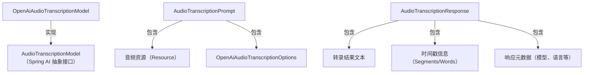

# Spring AI OpenAI 音频转录（语音转文字）完整使用文档

## 一、核心定位与基础概念

### 1. 模块定位

Spring AI `spring-ai-starter-model-openai` 模块封装了 **OpenAI 音频转录 API**，核心作用是：

通过统一的 Spring 风格接口，将音频文件（如语音、访谈）转换为文本，支持多种转录模型（Whisper、GPT-4o 系列）、输出格式（JSON/TEXT/SRT/VTT），无需关注底层 HTTP 调用、音频编码等复杂度，同时提供重试、配置管理等企业级特性。

### 2. 关键术语定义


| 术语                | 说明                                              |
| ----------------- | ----------------------------------------------- |
| 音频转录              | 将音频文件中的语音内容转换为文本的过程（语音转文字）                      |
| 转录模型              | OpenAI 提供的语音识别模型（如 Whisper-1、GPT-4o-transcribe） |
| 响应格式              | 转录结果的输出类型（JSON/TEXT/SRT/VTT/verbose\_json）      |
| 时间戳粒度             | 转录文本对应的音频时间标记精度（`segments` 段落级 / `words` 单词级）   |
| 温度参数（temperature） | 控制转录结果的随机性（0\~1，值越低越精准，值越高越灵活）                  |
| 提示词（prompt）       | 指导模型转录风格或补充上下文（如专业术语统一、口音校正）                    |

### 3. 支持的转录模型对比


| 模型名称                     | 核心特性                   | 适用场景                 | 优势                  | 限制                           |
| ------------------------ | ---------------------- | -------------------- | ------------------- | ---------------------------- |
| `whisper-1`              | 通用语音识别，支持多语言           | 日常对话、访谈、通用音频转录       | 支持 99+ 语言，性价比高，响应快  | 复杂专业场景精度略低                   |
| `gpt-4o-transcribe`      | GPT-4o 驱动，支持多语言、复杂语义理解 | 专业领域（医疗、法律）、带口音的语音转录 | 语义理解强，专业术语识别准，支持长音频 | 响应速度较慢，成本高于 Whisper-1        |
| `gpt-4o-mini-transcribe` | GPT-4o mini 驱动，平衡精度与速度 | 轻量场景（短音频、实时转录）       | 速度快，成本低             | 复杂场景精度不如 `gpt-4o-transcribe` |

## 二、环境准备

### 1. 先决条件


* **OpenAI 账户**：注册地址 [http](https://platform.openai.com/signup)[s://p](https://platform.openai.com/signup)[latfo](https://platform.openai.com/signup)[rm.op](https://platform.openai.com/signup)[enai.](https://platform.openai.com/signup)[com/s](https://platform.openai.com/signup)[ignup](https://platform.openai.com/signup)

* **API 密钥**：生成地址 [h](https://platform.openai.com/api-keys)[ttps:](https://platform.openai.com/api-keys)[//pla](https://platform.openai.com/api-keys)[tform](https://platform.openai.com/api-keys)[.open](https://platform.openai.com/api-keys)[ai.co](https://platform.openai.com/api-keys)[m/api](https://platform.openai.com/api-keys)[-keys](https://platform.openai.com/api-keys)（推荐创建 “音频转录专用密钥”）

* **可选信息**：多组织 / 多项目用户需记录 `Organization ID` 和 `Project ID`（OpenAI 控制台 > 个人中心获取）

* **音频文件**：支持格式（FLAC、MP3、WAV、M4A 等，OpenAI 推荐 FLAC 无损格式以提升精度）

### 2. 依赖配置

#### 2.1 Maven 配置（pom.xml）


```
\<!-- 1. 引入 Spring AI BOM（统一版本管理） -->

\<dependencyManagement>

&#x20;   \<dependencies>

&#x20;       \<dependency>

&#x20;           \<groupId>org.springframework.ai\</groupId>

&#x20;           \<artifactId>spring-ai-bom\</artifactId>

&#x20;           \<version>1.1.0\</version> \<!-- 与 Spring AI 版本保持一致 -->

&#x20;           \<type>pom\</type>

&#x20;           \<scope>import\</scope>

&#x20;       \</dependency>

&#x20;   \</dependencies>

\</dependencyManagement>

\<!-- 2. 引入 OpenAI 音频转录依赖（与图像生成共用同一 starter） -->

\<dependencies>

&#x20;   \<dependency>

&#x20;       \<groupId>org.springframework.ai\</groupId>

&#x20;       \<artifactId>spring-ai-starter-model-openai\</artifactId>

&#x20;   \</dependency>

&#x20;   \<!-- 可选：Spring Boot Web 依赖（用于接口暴露） -->

&#x20;   \<dependency>

&#x20;       \<groupId>org.springframework.boot\</groupId>

&#x20;       \<artifactId>spring-boot-starter-web\</artifactId>

&#x20;   \</dependency>

&#x20;   \<!-- 可选：文件处理依赖（用于读取本地/上传的音频文件） -->

&#x20;   \<dependency>

&#x20;       \<groupId>org.springframework.boot\</groupId>

&#x20;       \<artifactId>spring-boot-starter-webflux\</artifactId>

&#x20;   \</dependency>

\</dependencies>
```

#### 2.2 Gradle 配置（build.gradle）


```
// 1. 引入 Spring AI BOM

dependencyManagement {

&#x20;   imports {

&#x20;       mavenBom 'org.springframework.ai:spring-ai-bom:1.1.0'

&#x20;   }

}

// 2. 引入依赖

dependencies {

&#x20;   implementation 'org.springframework.ai:spring-ai-starter-model-openai'

&#x20;   // 可选：Spring Boot Web 依赖

&#x20;   implementation 'org.springframework.boot:spring-boot-starter-web'

&#x20;   // 可选：文件处理依赖

&#x20;   implementation 'org.springframework.boot:spring-boot-starter-webflux'

}
```

### 3. API 密钥安全配置

**严禁硬编码密钥**，推荐以下两种配置方式（优先级：环境变量 > 配置文件）：

#### 3.1 环境变量配置（推荐）


* **Windows（CMD 终端）**：


```
set OPENAI\_API\_KEY=sk-你的API密钥（如 sk-xxxxxxxxxxxxxxxxxxxxxxxxxx）
```


* **Linux/Mac（终端）**：


```
export OPENAI\_API\_KEY=sk-你的API密钥
```


* **生产环境**：在服务器 / 容器（Docker/K8s）的环境变量中配置

#### 3.2 配置文件配置（application.yml）


```
spring:

&#x20; ai:

&#x20;   # 1. OpenAI 全局连接配置

&#x20;   openai:

&#x20;     api-key: \${OPENAI\_API\_KEY} # 引用环境变量，避免硬编码

&#x20;     organization-id: \${OPENAI\_ORG\_ID:} # 可选，多组织用户配置

&#x20;     project-id: \${OPENAI\_PROJECT\_ID:} # 可选，多项目用户配置

&#x20;     base-url: \${OPENAI\_BASE\_URL:api.openai.com} # 可选，代理场景配置

&#x20;  &#x20;

&#x20;   # 2. 音频转录专属配置（覆盖全局配置）

&#x20;   openai:

&#x20;     audio:

&#x20;       transcription:

&#x20;         base-url: \${OPENAI\_TRANSCRIBE\_BASE\_URL:} # 转录专属代理地址（可选）

&#x20;         api-key: \${OPENAI\_TRANSCRIBE\_API\_KEY:} # 转录专属密钥（可选）

&#x20;         options:

&#x20;           # 转录默认参数（启动时配置，可被运行时覆盖）

&#x20;           model: whisper-1 # 默认模型

&#x20;           response-format: json # 默认响应格式

&#x20;           language: zh # 默认语言（ISO-639-1 格式，如 zh=中文、en=英文）

&#x20;           temperature: 0.0 # 默认温度（0 最精准）

&#x20;           timestamp\_granularities: segments # 默认时间戳粒度（段落级）

&#x20;  &#x20;

&#x20;   # 3. 转录模型启用开关（默认启用 OpenAI 转录）

&#x20;   model:

&#x20;     audio:

&#x20;       transcription: openai # 禁用时设为 none

&#x20;  &#x20;

&#x20;   # 4. 重试机制配置（针对网络波动、服务限流）

&#x20;   retry:

&#x20;     max-attempts: 5 # 最大重试次数

&#x20;     backoff:

&#x20;       initial-interval: 1000ms # 初始退避时间

&#x20;       multiplier: 2 # 退避倍数（每次重试间隔 ×2）

&#x20;       max-interval: 60000ms # 最大退避时间（1分钟）

&#x20;     on-client-errors: false # 4xx 客户端错误不重试

&#x20;     on-http-codes: \[500, 503, 504] # 仅对服务端错误重试
```

## 三、核心配置详解

### 1. 配置优先级

Spring AI 音频转录支持三级配置，优先级从高到低为：

`运行时参数（AudioTranscriptionPrompt 中的 Options）` > `转录专属配置（``spring.ai``.openai.audio.transcription.*）` > `全局配置（``spring.ai``.openai.*）`

### 2. 关键配置项说明

#### 2.1 全局连接配置（spring.ai.openai.\*）


| 配置项                              | 描述              | 默认值                                      | 说明                                         |
| -------------------------------- | --------------- | ---------------------------------------- | ------------------------------------------ |
| spring.ai.openai.base-url        | OpenAI API 基础地址 | [api.openai.com](https://api.openai.com) | 代理场景可改为自定义地址（如 `https://openai-proxy.com`） |
| spring.ai.openai.api-key         | 全局 API 密钥       | -                                        | 必须配置，通过环境变量或配置文件注入                         |
| spring.ai.openai.organization-id | 组织 ID           | -                                        | 多组织用户配置，关联账单                               |
| spring.ai.openai.project-id      | 项目 ID           | -                                        | 多项目用户配置，关联项目使用量                            |

#### 2.2 转录专属配置（spring.ai.openai.audio.transcription.\*）


| 配置项                                           | 描述          | 默认值           | 说明               |
| --------------------------------------------- | ----------- | ------------- | ---------------- |
| spring.ai.openai.audio.transcription.base-url | 转录专属基础地址    | 继承全局 base-url | 单独配置转录的代理地址（可选）  |
| spring.ai.openai.audio.transcription.api-key  | 转录专属 API 密钥 | 继承全局 api-key  | 单独使用一个密钥用于转录（可选） |
| spring.ai.model.audio.transcription           | 转录模型启用开关    | openai        | 禁用时设为 none       |

#### 2.3 转录选项参数（spring.ai.openai.audio.transcription.options.\*）


| 配置项                      | 描述    | 默认值       | 取值范围 / 说明                                              |
| ------------------------ | ----- | --------- | ------------------------------------------------------ |
| model                    | 转录模型  | whisper-1 | whisper-1 / gpt-4o-transcribe / gpt-4o-mini-transcribe |
| response-format          | 响应格式  | json      | json / text / srt / vtt / verbose\_json                |
| language                 | 音频语言  | -         | ISO-639-1 格式（如 zh = 中文、en = 英文、ja = 日文）                |
| temperature              | 温度参数  | 0.0       | 0\~1（0 最精准，1 最灵活）                                      |
| prompt                   | 提示词   | -         | 指导模型转录风格（如 “统一将‘AI’译为‘人工智能’”）                          |
| timestamp\_granularities | 时间戳粒度 | segments  | segments（段落级） /words（单词级）                              |

## 四、核心 API 详解

### 1. 核心类关系




### 2. 关键类说明

#### 2.1 OpenAiAudioTranscriptionModel（核心客户端）


* **作用**：Spring AI 封装的 OpenAI 音频转录客户端，负责发送音频数据并接收转录结果

* **创建方式**：Spring Boot 自动注入（无需手动创建，依赖 `spring-ai-starter-model-openai`）


```
@Autowired

private OpenAiAudioTranscriptionModel transcriptionModel; // 直接注入使用
```

#### 2.2 AudioTranscriptionPrompt（请求封装）


* **作用**：封装 “音频资源 + 转录选项”，作为 `transcriptionModel.call()` 的入参

* **核心构造**：


```
// 1. 基础构造（音频资源 + 默认选项）

Resource audioResource = new FileSystemResource("D:/audio/speech.flac"); // 本地音频文件

AudioTranscriptionPrompt prompt = new AudioTranscriptionPrompt(audioResource);

// 2. 完整构造（音频资源 + 自定义选项）

OpenAiAudioTranscriptionOptions options = OpenAiAudioTranscriptionOptions.builder()

&#x20;   .model("gpt-4o-transcribe")

&#x20;   .responseFormat(OpenAiAudioApi.TranscriptResponseFormat.SRT)

&#x20;   .language("zh")

&#x20;   .build();

AudioTranscriptionPrompt prompt = new AudioTranscriptionPrompt(audioResource, options);
```


* **音频资源类型**：支持 `FileSystemResource`（本地文件）、`ClassPathResource`（类路径资源）、`MultipartFileResource`（上传文件）

#### 2.3 OpenAiAudioTranscriptionOptions（转录选项）


* **作用**：通过 Builder 模式配置转录参数，支持链式调用

* **常用方法**：


```
OpenAiAudioTranscriptionOptions options = OpenAiAudioTranscriptionOptions.builder()

&#x20;   .model("whisper-1") // 设置模型

&#x20;   .responseFormat(OpenAiAudioApi.TranscriptResponseFormat.TEXT) // 设置输出格式为纯文本

&#x20;   .language("en") // 设置音频语言为英文

&#x20;   .temperature(0.2f) // 设置温度（略高于默认，保留少量灵活性）

&#x20;   .prompt("将‘LLM’统一译为‘大语言模型’") // 提示词校正术语

&#x20;   .timestampGranularities(List.of(OpenAiAudioApi.TimestampGranularity.WORDS)) // 单词级时间戳

&#x20;   .build();
```

#### 2.4 AudioTranscriptionResponse（响应封装）


* **作用**：存储转录结果及元数据，支持不同格式的结果提取

* **核心方法**：


| 方法              | 描述                         | 返回值类型                         |
| --------------- | -------------------------- | ----------------------------- |
| getTranscript() | 获取转录文本（纯文本 / JSON/SRT 字符串） | String                        |
| getSegments()   | 获取段落级时间戳（需开启 segments 粒度）  | List                          |
| getWords()      | 获取单词级时间戳（需开启 words 粒度）     | List                          |
| getMetadata()   | 获取响应元数据（模型、语言、时长等）         | TranscriptionResponseMetadata |

### 3. 核心方法：call ()


* **作用**：同步调用 OpenAI 转录 API，返回 `AudioTranscriptionResponse`

* **方法签名**：


```
AudioTranscriptionResponse call(AudioTranscriptionPrompt prompt);
```


* **说明**：转录耗时与音频时长正相关（如 10 分钟音频约需 30\~60 秒），建议在异步线程中调用以避免阻塞主线程。

## 五、实战示例（可直接复制使用）

### 示例 1：基础音频转录（默认配置）

**场景**：将本地 FLAC 音频文件转为 JSON 格式的转录文本，使用默认的 `whisper-1` 模型。


```
import org.springframework.ai.openai.audio.transcription.AudioTranscriptionPrompt;

import org.springframework.ai.openai.audio.transcription.AudioTranscriptionResponse;

import org.springframework.ai.openai.audio.transcription.OpenAiAudioTranscriptionModel;

import org.springframework.beans.factory.annotation.Autowired;

import org.springframework.core.io.FileSystemResource;

import org.springframework.core.io.Resource;

import org.springframework.web.bind.annotation.PostMapping;

import org.springframework.web.bind.annotation.RequestMapping;

import org.springframework.web.bind.annotation.RestController;

@RestController

@RequestMapping("/api/transcribe")

public class BasicTranscriptionController {

&#x20;   @Autowired

&#x20;   private OpenAiAudioTranscriptionModel transcriptionModel;

&#x20;   /\*\*

&#x20;    \* 基础音频转录接口（本地文件）

&#x20;    \* @return 转录结果（JSON 格式）

&#x20;    \*/

&#x20;   @PostMapping("/basic")

&#x20;   public String basicTranscribe() {

&#x20;       try {

&#x20;           // 1. 加载本地音频文件（FLAC 格式，推荐无损）

&#x20;           Resource audioResource = new FileSystemResource("D:/audio/interview.flac");

&#x20;          &#x20;

&#x20;           // 2. 构建请求（使用配置文件中的默认选项）

&#x20;           AudioTranscriptionPrompt prompt = new AudioTranscriptionPrompt(audioResource);

&#x20;          &#x20;

&#x20;           // 3. 调用转录模型

&#x20;           AudioTranscriptionResponse response = transcriptionModel.call(prompt);

&#x20;          &#x20;

&#x20;           // 4. 返回转录结果（JSON 字符串）

&#x20;           return response.getTranscript();

&#x20;       } catch (Exception e) {

&#x20;           return "转录失败：" + e.getMessage();

&#x20;       }

&#x20;   }

}
```

**调用方式**（Postman/ curl）：


```
curl -X POST http://localhost:8080/api/transcribe/basic
```

**返回结果**（JSON 格式）：


```
{

&#x20; "text": "今天我们来讨论 Spring AI 的音频转录功能...",

&#x20; "segments": \[

&#x20;   {

&#x20;     "id": 0,

&#x20;     "start": 0.0,

&#x20;     "end": 5.2,

&#x20;     "text": "今天我们来讨论 Spring AI 的音频转录功能..."

&#x20;   }

&#x20; ],

&#x20; "language": "zh"

}
```

### 示例 2：自定义参数转录（SRT 格式 + 中文）

**场景**：将上传的 MP3 音频转为 SRT 字幕格式（带时间戳），指定 `gpt-4o-transcribe` 模型和中文语言。


```
import org.springframework.ai.openai.audio.OpenAiAudioApi;

import org.springframework.ai.openai.audio.transcription.AudioTranscriptionPrompt;

import org.springframework.ai.openai.audio.transcription.AudioTranscriptionResponse;

import org.springframework.ai.openai.audio.transcription.OpenAiAudioTranscriptionModel;

import org.springframework.ai.openai.audio.transcription.OpenAiAudioTranscriptionOptions;

import org.springframework.beans.factory.annotation.Autowired;

import org.springframework.http.MediaType;

import org.springframework.web.bind.annotation.PostMapping;

import org.springframework.web.bind.annotation.RequestMapping;

import org.springframework.web.bind.annotation.RequestParam;

import org.springframework.web.bind.annotation.RestController;

import org.springframework.web.multipart.MultipartFile;

import org.springframework.web.multipart.support.StandardMultipartHttpServletRequest;

import java.io.IOException;

@RestController

@RequestMapping("/api/transcribe")

public class CustomTranscriptionController {

&#x20;   @Autowired

&#x20;   private OpenAiAudioTranscriptionModel transcriptionModel;

&#x20;   /\*\*

&#x20;    \* 自定义参数转录接口（支持文件上传）

&#x20;    \* @param file 上传的音频文件（MP3/FLAC/WAV 等）

&#x20;    \* @return SRT 格式的字幕文本

&#x20;    \*/

&#x20;   @PostMapping(value = "/custom", consumes = MediaType.MULTIPART\_FORM\_DATA\_VALUE)

&#x20;   public String customTranscribe(@RequestParam("file") MultipartFile file) throws IOException {

&#x20;       // 1. 构建自定义转录选项

&#x20;       OpenAiAudioTranscriptionOptions options = OpenAiAudioTranscriptionOptions.builder()

&#x20;           .model("gpt-4o-transcribe") // 使用 GPT-4o 模型提升精度

&#x20;           .responseFormat(OpenAiAudioApi.TranscriptResponseFormat.SRT) // 输出 SRT 字幕

&#x20;           .language("zh") // 明确指定音频语言为中文

&#x20;           .temperature(0.1f) // 低温度保证精准度

&#x20;           .prompt("将‘Spring AI’统一译为‘Spring 人工智能框架’，‘API’译为‘应用程序接口’") // 术语校正

&#x20;           .build();

&#x20;       // 2. 将 MultipartFile 转为 Spring  Resource

&#x20;       org.springframework.core.io.Resource audioResource = new org.springframework.web.multipart.support.StandardMultipartFileResource(

&#x20;           (StandardMultipartHttpServletRequest.StandardMultipartFile) file);

&#x20;       // 3. 构建请求

&#x20;       AudioTranscriptionPrompt prompt = new AudioTranscriptionPrompt(audioResource, options);

&#x20;       // 4. 调用转录模型

&#x20;       AudioTranscriptionResponse response = transcriptionModel.call(prompt);

&#x20;       // 5. 返回 SRT 格式结果

&#x20;       return response.getTranscript();

&#x20;   }

}
```

**调用方式**（Postman）：


1. 选择 `POST` 方法，地址 `http://localhost:8080/api/transcribe/custom`

2. `Body` 选择 `form-data`，键 `file` 选择本地音频文件（如 `speech.mp3`）

3. 发送请求，返回 SRT 字幕文本。

**返回结果**（SRT 格式）：


```
1

00:00:00,000 --> 00:00:05,200

今天我们来讨论 Spring 人工智能框架的音频转录功能。

2

00:00:05,200 --> 00:00:10,500

该功能支持多种音频格式，包括 MP3、FLAC 和 WAV。
```

### 示例 3：手动配置模型（不依赖自动注入）

**场景**：不使用 Spring 自动配置，手动创建转录模型实例（适用于非 Spring Boot 项目或自定义配置场景）。


```
import org.springframework.ai.openai.audio.OpenAiAudioApi;

import org.springframework.ai.openai.audio.transcription.AudioTranscriptionPrompt;

import org.springframework.ai.openai.audio.transcription.AudioTranscriptionResponse;

import org.springframework.ai.openai.audio.transcription.OpenAiAudioTranscriptionModel;

import org.springframework.ai.openai.audio.transcription.OpenAiAudioTranscriptionOptions;

import org.springframework.core.io.FileSystemResource;

import org.springframework.core.io.Resource;

public class ManualTranscriptionExample {

&#x20;   public static void main(String\[] args) {

&#x20;       // 1. 手动配置 OpenAI API 客户端

&#x20;       String apiKey = System.getenv("OPENAI\_API\_KEY"); // 从环境变量获取密钥

&#x20;       OpenAiAudioApi openAiAudioApi = new OpenAiAudioApi(apiKey);

&#x20;       // 2. 手动创建转录模型

&#x20;       OpenAiAudioTranscriptionModel transcriptionModel = new OpenAiAudioTranscriptionModel(openAiAudioApi);

&#x20;       // 3. 配置转录选项

&#x20;       OpenAiAudioTranscriptionOptions options = OpenAiAudioTranscriptionOptions.builder()

&#x20;           .model("whisper-1")

&#x20;           .responseFormat(OpenAiAudioApi.TranscriptResponseFormat.TEXT)

&#x20;           .language("en")

&#x20;           .build();

&#x20;       try {

&#x20;           // 4. 加载音频资源

&#x20;           Resource audioResource = new FileSystemResource("D:/audio/english-speech.flac");

&#x20;           // 5. 构建请求并调用

&#x20;           AudioTranscriptionPrompt prompt = new AudioTranscriptionPrompt(audioResource, options);

&#x20;           AudioTranscriptionResponse response = transcriptionModel.call(prompt);

&#x20;           // 6. 打印转录结果

&#x20;           System.out.println("转录结果：");

&#x20;           System.out.println(response.getTranscript());

&#x20;       } catch (Exception e) {

&#x20;           e.printStackTrace();

&#x20;       }

&#x20;   }

}
```

### 示例 4：全局异常处理

**场景**：统一处理转录过程中的异常（如密钥无效、音频格式不支持、服务限流）。


```
import org.springframework.ai.openai.OpenAiApiException;

import org.springframework.ai.retry.TransientAiException;

import org.springframework.http.HttpStatus;

import org.springframework.http.ResponseEntity;

import org.springframework.web.bind.annotation.ExceptionHandler;

import org.springframework.web.bind.annotation.RestControllerAdvice;

import org.springframework.web.multipart.MaxUploadSizeExceededException;

import java.util.HashMap;

import java.util.Map;

@RestControllerAdvice

public class TranscriptionExceptionHandler {

&#x20;   /\*\*

&#x20;    \* 处理 OpenAI API 直接错误（密钥无效、提示词违规等）

&#x20;    \*/

&#x20;   @ExceptionHandler(OpenAiApiException.class)

&#x20;   public ResponseEntity\<Map\<String, String>> handleOpenAiApiException(OpenAiApiException e) {

&#x20;       Map\<String, String> result = new HashMap<>();

&#x20;       result.put("code", "400");

&#x20;       result.put("message", "API 调用失败：" + e.getMessage());

&#x20;       return new ResponseEntity<>(result, HttpStatus.BAD\_REQUEST);

&#x20;   }

&#x20;   /\*\*

&#x20;    \* 处理服务端临时错误（网络波动、限流）

&#x20;    \*/

&#x20;   @ExceptionHandler(TransientAiException.class)

&#x20;   public ResponseEntity\<Map\<String, String>> handleTransientException(TransientAiException e) {

&#x20;       Map\<String, String> result = new HashMap<>();

&#x20;       result.put("code", "503");

&#x20;       result.put("message", "服务暂时不可用，请稍后重试：" + e.getMessage());

&#x20;       return new ResponseEntity<>(result, HttpStatus.SERVICE\_UNAVAILABLE);

&#x20;   }

&#x20;   /\*\*

&#x20;    \* 处理音频文件过大错误

&#x20;    \*/

&#x20;   @ExceptionHandler(MaxUploadSizeExceededException.class)

&#x20;   public ResponseEntity\<Map\<String, String>> handleFileTooLarge(MaxUploadSizeExceededException e) {

&#x20;       Map\<String, String> result = new HashMap<>();

&#x20;       result.put("code", "413");

&#x20;       result.put("message", "音频文件过大：请上传小于 25MB 的文件（OpenAI 限制）");

&#x20;       return new ResponseEntity<>(result, HttpStatus.PAYLOAD\_TOO\_LARGE);

&#x20;   }

&#x20;   /\*\*

&#x20;    \* 处理其他未知错误

&#x20;    \*/

&#x20;   @ExceptionHandler(Exception.class)

&#x20;   public ResponseEntity\<Map\<String, String>> handleException(Exception e) {

&#x20;       Map\<String, String> result = new HashMap<>();

&#x20;       result.put("code", "500");

&#x20;       result.put("message", "音频转录失败：" + e.getMessage());

&#x20;       return new ResponseEntity<>(result, HttpStatus.INTERNAL\_SERVER\_ERROR);

&#x20;   }

}
```

## 六、进阶技巧与注意事项

### 1. 模型选择建议


* **日常场景**：优先使用 `whisper-1`（支持多语言、性价比高、响应快）

* **专业场景**（医疗、法律、带口音）：使用 `gpt-4o-transcribe`（语义理解强，专业术语识别准）

* **轻量场景**（短音频、实时转录）：使用 `gpt-4o-mini-transcribe`（平衡速度与成本）

### 2. 音频格式与大小限制


* **推荐格式**：FLAC（无损）> WAV > MP3（有损），无损格式可提升转录精度

* **大小限制**：单文件最大 25MB（OpenAI 官方限制），超过需分割音频（如用 FFmpeg 切割）

* **时长建议**：单段音频不超过 2 小时，过长会增加转录耗时和失败概率

### 3. 提示词（prompt）优化技巧


* **术语统一**：如 “将‘LLM’译为‘大语言模型’，‘RAG’译为‘检索增强生成’”

* **口音校正**：如 “音频带四川口音，注意‘四’和‘十’的区分”

* **上下文补充**：如 “这是一场 Java 技术分享，‘JVM’指 Java 虚拟机”

* **格式要求**：如 “转录结果中保留所有标点符号，不省略语气词”

### 4. 性能优化


* **温度参数**：追求精准度时设为 `0.0~0.2`，允许少量灵活性时设为 `0.3~0.5`，避免设为 `1.0`（易产生错误）

* **时间戳粒度**：仅需段落级时间戳时禁用 `words`（减少转录耗时和响应大小）

* **异步调用**：长音频转录（>5 分钟）建议用 `@Async` 异步处理，避免阻塞主线程：


```
@Async

public CompletableFuture\<AudioTranscriptionResponse> asyncTranscribe(Resource audioResource) {

&#x20;   AudioTranscriptionPrompt prompt = new AudioTranscriptionPrompt(audioResource);

&#x20;   return CompletableFuture.completedFuture(transcriptionModel.call(prompt));

}
```

## 七、常见问题（FAQ）

### Q1：转录时提示 “API key is invalid”？


* 检查密钥是否正确（避免空格、换行或多余字符）

* 检查密钥是否有音频转录权限（OpenAI 密钥默认支持所有 API，若被限制需在控制台解除）

* 检查环境变量 / 配置文件是否正确注入密钥

### Q2：音频文件上传后提示 “unsupported audio format”？


* 确认文件格式是否在支持列表（FLAC/MP3/WAV/M4A 等）

* 检查文件是否损坏（可用播放器测试能否正常播放）

* 若为特殊格式（如 AAC），用 FFmpeg 转换为 MP3/FLAC：


```
ffmpeg -i input.aac -acodec flac output.flac
```

### Q3：转录结果缺失部分内容或有错误？


* 改用无损格式（如 FLAC）重新上传

* 增加提示词补充上下文（如专业术语、口音说明）

* 切换到 `gpt-4o-transcribe` 模型（精度更高）

* 降低温度参数（如从 `0.5` 改为 `0.0`）

### Q4：转录耗时过长或超时？


* 检查音频大小（超过 10MB 会增加耗时，建议分割）

* 优化重试配置（缩短退避时间，减少重试次数）

* 改用 `whisper-1` 模型（比 GPT-4o 系列快 2\~3 倍）

* 确认网络是否稳定（代理场景需检查代理速度）

### Q5：SRT/VTT 格式没有时间戳？


* 检查是否开启时间戳粒度：需在选项中配置 `timestampGranularities`（`segments` 或 `words`）

* 确认响应格式是否为 `SRT` 或 `VTT`（`JSON` 格式需手动解析时间戳）

## 八、参考资源


1. **Spring AI 官方文档**：[OpenAI 音频转录](https://docs.spring.io/spring-ai/docs/1.1.0/reference/html/openai.html#openai-audio-transcription)

2. **OpenAI 官方文档**：[音频转录 API](https://platform.openai.com/docs/guides/speech-to-text)

3. **Spring AI 示例仓库**：[音频转录示例](https://github.com/spring-projects/spring-ai/tree/main/samples/openai-audio)

4. **FFmpeg 音频处理**：[音频格式转换 / 切割工具](https://ffmpeg.org/)

5. **ISO-639-1 语言代码**：[语言代码对照表](https://en.wikipedia.org/wiki/ISO_639-1)

> （注：文档部分内容可能由 AI 生成）